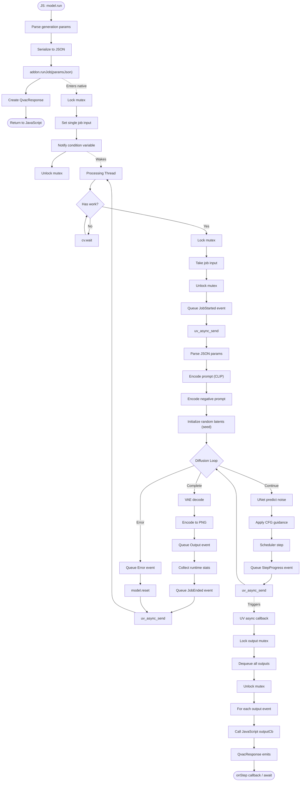

# Detailed Data Flows

This document contains detailed diagrams showing how data moves through the `@qvac/diffusion-cpp` system.

**Audience:** Developers debugging complex behavior, contributors understanding system interactions.

> **⚠️ Note:** These detailed diagrams are intended for initial reference and can quickly become outdated as the codebase evolves. For exact debugging and deep understanding, regenerate diagrams from the actual code or trace through the implementation directly.

⚡ TL;DR: Data Flow Overview

**Communication Pattern:**
- Two-thread architecture: JavaScript thread + dedicated C++ processing thread
- Synchronization via mutex and condition variables
- Cross-thread flow: JS → submit job via `runJob(params)` → wake C++ → process diffusion steps → output → uv_async_send → JS callback

**Generation Path:**
- JS calls `model.run(params)` → returns QvacResponse immediately (non-blocking)
- JS serializes params to JSON, calls `addon.runJob(paramsJson)` once; returns boolean (accepted or job already active)
- C++ single-job runner takes the job, executes diffusion loop → generates image
- Queues progress/output events → triggers JS callback asynchronously
- Emits: StepProgress, Output (final image), JobStarted, JobEnded, Error

## Table of Contents

- [Text-to-Image Generation Flow](#text-to-image-generation-flow)

---

## Text-to-Image Generation Flow

### High-Level Flow

📊 LLM-Friendly: Generation Flow Breakdown

**Phase 1: Job Submission (JavaScript → C++)**

| Step | Thread | Duration | Operation | Blocking? |
|------|--------|----------|-----------|-----------|
| 1 | JS | <0.1ms | Parse params | No |
| 2 | JS | <0.1ms | Serialize to JSON | No |
| 3 | JS | <1ms | Call addon.runJob(params) | No |
| 4 | JS | <0.1ms | Lock mutex | No |
| 5 | JS | <0.1ms | Set job input | No |
| 6 | JS | <0.1ms | Signal CV | No |
| 7 | JS | <0.1ms | Unlock mutex | No |
| 8 | JS | <0.1ms | Return accepted (boolean) | No |
| 9 | C++ | - | Wake from cv.wait() | - |

**Phase 2: Processing (C++ Background Thread)**

| Step | Thread | Duration | Operation | Blocks JS? |
|------|--------|----------|-----------|------------|
| 10 | C++ | <0.1ms | Lock mutex | No |
| 11 | C++ | <0.1ms | Take job input | No |
| 12 | C++ | <0.1ms | Unlock mutex | No |
| 13 | C++ | <1ms | Parse JSON params | No |
| 14 | C++ | 50-200ms | Encode prompts (CLIP) | No |
| 15 | C++ | <10ms | Initialize latents | No |
| 16 | C++ | 100-500ms per step | UNet inference | No |
| 17 | C++ | 200-1000ms | VAE decode | No |
| 18 | C++ | 10-50ms | PNG encode | No |

**Phase 3: Output Delivery (C++ → JavaScript)**

| Step | Thread | Duration | Operation | Details |
|------|--------|----------|-----------|---------|
| 19 | C++ | <0.1ms | Lock output mutex | Per step |
| 20 | C++ | <0.1ms | Queue progress | Per step |
| 21 | C++ | <0.1ms | Unlock mutex | Per step |
| 22 | C++ | <0.1ms | uv_async_send() | May coalesce |
| 23 | JS | - | UV schedules callback | Next tick |
| 24 | JS | <0.1ms | Lock mutex | Batch |
| 25 | JS | <0.1ms | Drain outputs | Batch |
| 26 | JS | <0.1ms | Unlock mutex | Batch |
| 27 | JS | Varies | Invoke outputCb | User code |

**Event Types:**

| Event | When | Data | Purpose |
|-------|------|------|---------|
| JobStarted | Processing begins | {jobId, timestamp} | Track start |
| StepProgress | Each diffusion step | {jobId, step, totalSteps} | Progress UI |
| Output | Generation complete | {jobId, image: Uint8Array, format: 'png'} | Final image |
| JobEnded | All processing done | {jobId, stats: RuntimeStats} | Track completion |
| Error | Processing fails | {jobId, error: string} | Error handling |

**Performance Characteristics:**

- Job queueing: <1ms total
- Prompt encoding: 50-200ms (depends on prompt length)
- Diffusion steps: 100-500ms per step (model and GPU dependent)
- VAE decoding: 200-1000ms (resolution dependent)
- Total 512x512, 20 steps: ~5-15 seconds
- Total 1024x1024, 20 steps: ~15-60 seconds

**Related Documents:**
- [architecture.md](architecture.md) - Complete architecture documentation

**Last Updated:** 2026-03-11
