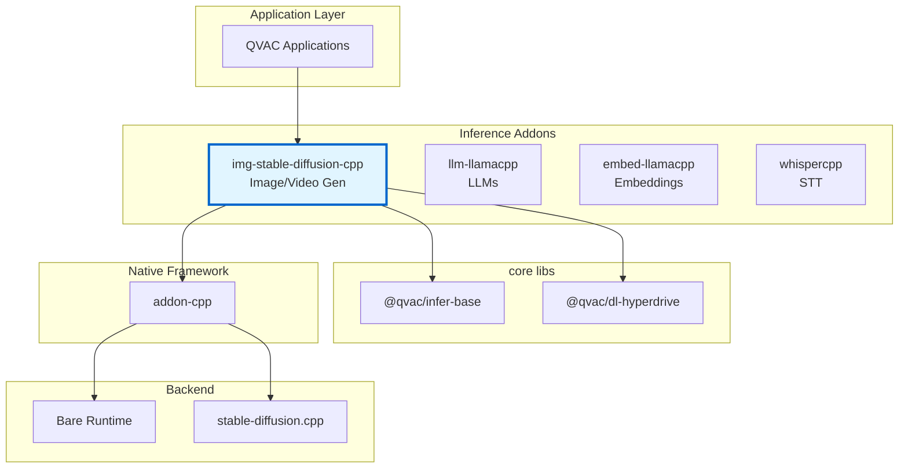
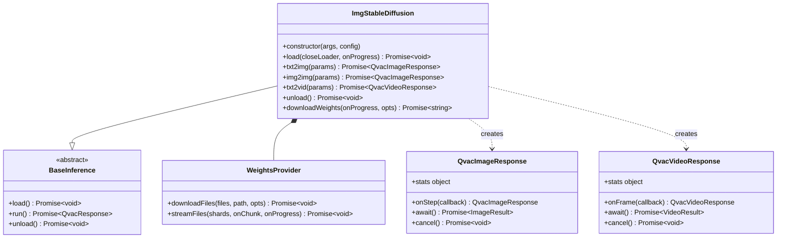
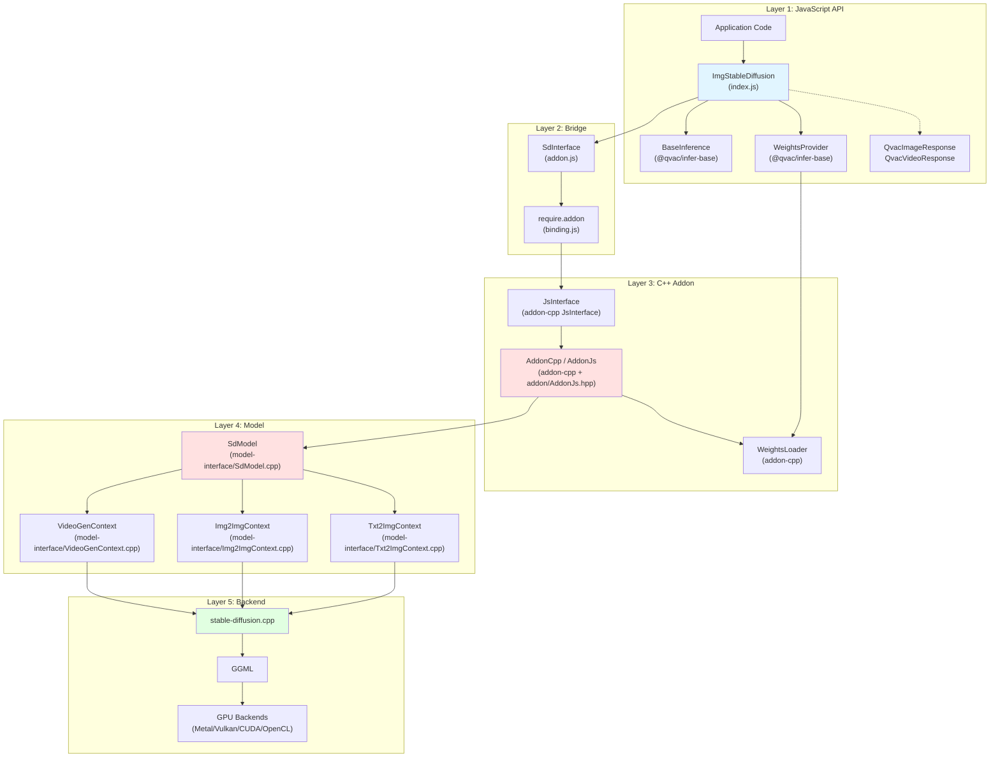
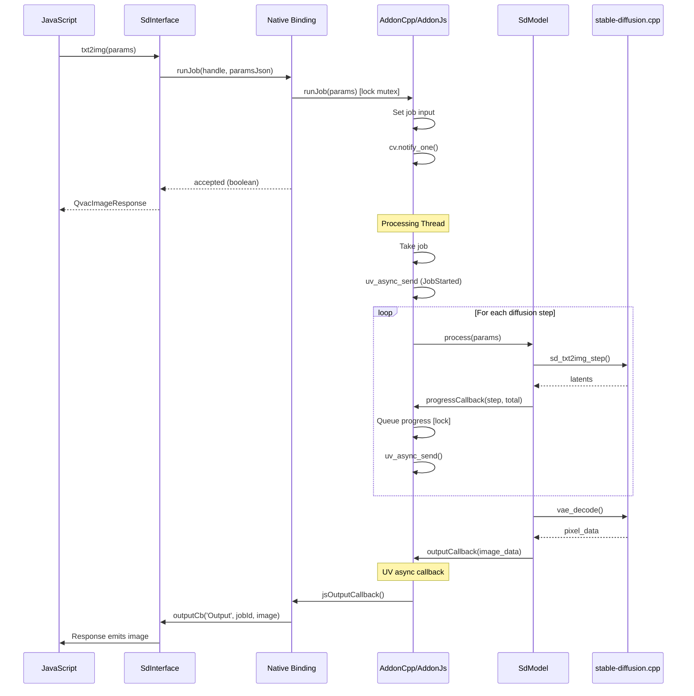

# Architecture Documentation

**Package:** `@qvac/img-stable-diffusion-cpp` v0.1.0  
**Stack:** JavaScript, C++20, stable-diffusion.cpp, Bare Runtime, CMake, vcpkg  
**License:** Apache-2.0

---

## Table of Contents

### Overview
- [Purpose](#purpose)
- [Key Features](#key-features)
- [Target Platforms](#target-platforms)

### Core Architecture
- [Package Context](#package-context)
- [Public API](#public-api)
- [Internal Architecture](#internal-architecture)
- [Core Components](#core-components)
- [Bare Runtime Integration](#bare-runtime-integration)

### Architecture Decisions
- [Decision 1: stable-diffusion.cpp as Inference Backend](#decision-1-stable-diffusioncpp-as-inference-backend)
- [Decision 2: Bare Runtime over Node.js](#decision-2-bare-runtime-over-nodejs)
- [Decision 3: Pluggable Data Loader Architecture](#decision-3-pluggable-data-loader-architecture)
- [Decision 4: Incremental Buffer-Based Weight Loading](#decision-4-incremental-buffer-based-weight-loading)
- [Decision 5: Generation Parameters Format](#decision-5-generation-parameters-format-json-serialization)
- [Decision 6: Exclusive Run Queue](#decision-6-exclusive-run-queue-indexjs)
- [Decision 7: TypeScript Definitions](#decision-7-typescript-definitions)

### Technical Debt
- [Limited Error Context](#1-limited-error-context)

---

# Overview

## Purpose

`@qvac/img-stable-diffusion-cpp` is a cross-platform npm package providing diffusion model inference for Bare runtime applications. It wraps stable-diffusion.cpp in a JavaScript-friendly API, enabling local image and video generation on desktop and mobile with CPU/GPU acceleration.

**Core value:**
- High-level JavaScript API for diffusion model inference
- Peer-to-peer model distribution via Hyperdrive
- Progress callback during generation steps
- Text-to-image, image-to-image, and video generation
- Pluggable model weight loaders

## Key Features

- **Cross-platform**: macOS, Linux, Windows, iOS, Android
- **Multiple loaders**: Hyperdrive (P2P), filesystem, custom
- **Progress tracking**: Step-by-step generation progress callbacks
- **GPU acceleration**: Metal, Vulkan, CUDA, OpenCL
- **Quantized models**: GGUF, safetensors, checkpoint formats
- **Diffusion models**: SD1.x, SD2.x, SDXL, SD3, FLUX, Wan (video), Qwen Image, Z-Image
- **Advanced features**: LoRA, ControlNet, ESRGAN upscaling, TAESD decoding
- **Generation modes**: txt2img, img2img, inpainting, video generation

## Target Platforms

| Platform | Architecture | Min Version | Status | GPU Support |
|----------|-------------|-------------|--------|-------------|
| macOS | arm64, x64 | 14.0+ | ✅ Tier 1 | Metal |
| iOS | arm64 | 17.0+ | ✅ Tier 1 | Metal |
| Linux | arm64, x64 | Ubuntu-22+ | ✅ Tier 1 | Vulkan, CUDA |
| Android | arm64 | 12+ | ✅ Tier 1 | Vulkan, OpenCL |
| Windows | x64 | 10+ | ✅ Tier 1 | Vulkan, CUDA |

**Dependencies:**
- qvac-lib-inference-addon-cpp (≥1.1.2): C++ addon framework (single-job runner, runJob/activate/loadWeights/cancel/destroyInstance)
- stable-diffusion.cpp: Diffusion inference engine
- Bare Runtime (≥1.24.0): JavaScript runtime
- Ubuntu-22 requires g++-13 installed

---

# Core Architecture

## Package Context

### Ecosystem Position



<details>
<summary>📊 LLM-Friendly: Package Relationships</summary>

**Dependency Table:**

| Package | Type | Version | Purpose |
|---------|------|---------|---------|
| @qvac/infer-base | Framework | ^0.2.0 | Base classes, WeightsProvider, QvacResponse |
| @qvac/dl-hyperdrive | Peer | ^0.1.1 | P2P model loading |
| qvac-lib-inference-addon-cpp | Native | ≥1.1.1 | C++ addon framework (single-job runner) |
| stable-diffusion.cpp | Native | latest | Diffusion inference engine |
| Bare Runtime | Runtime | ≥1.24.0 | JavaScript execution |

**Integration Points:**

| From | To | Mechanism | Data Format |
|------|-----|-----------|-------------|
| JavaScript | ImgStableDiffusion | Constructor | args, config objects |
| ImgStableDiffusion | BaseInference | Inheritance | Template method pattern |
| ImgStableDiffusion | SdInterface | Composition | Method calls |
| SdInterface | C++ Addon | require.addon() | Native binding |
| WeightsProvider | Data Loader | Interface | Stream protocol |

</details>

---

## Public API

### Main Class: ImgStableDiffusion



<details>
<summary>📊 LLM-Friendly: Class Responsibilities</summary>

**Component Roles:**

| Class | Responsibility | Lifecycle | Dependencies |
|-------|----------------|-----------|--------------|
| ImgStableDiffusion | Orchestrate model lifecycle, manage loading/inference | Created by user, persistent | WeightsProvider, SdInterface |
| BaseInference | Define standard inference API | Abstract base class | None |
| QvacImageResponse | Handle image generation progress and result | Created per txt2img/img2img call | None |
| QvacVideoResponse | Handle video generation progress and result | Created per txt2vid call | None |
| WeightsProvider | Abstract model weight loading | Created by ImgStableDiffusion | DataLoader |

**Key Relationships:**

| From | To | Type | Purpose |
|------|-----|------|---------|
| ImgStableDiffusion | BaseInference | Inheritance | Standard QVAC inference API |
| ImgStableDiffusion | WeightsProvider | Composition | Model weight acquisition |
| ImgStableDiffusion | QvacImageResponse | Creates | Progress/result per image generation |
| ImgStableDiffusion | QvacVideoResponse | Creates | Progress/result per video generation |

</details>

---

## Internal Architecture

### Architectural Pattern

The package follows a **layered architecture** with clear separation of concerns:



<details>
<summary>📊 LLM-Friendly: Layer Responsibilities</summary>

**Layer Breakdown:**

| Layer | Components | Responsibility | Language | Why This Layer |
|-------|------------|----------------|----------|----------------|
| 1. JavaScript API | ImgStableDiffusion, BaseInference | High-level API, error handling | JS | Ergonomic API for npm consumers |
| 2. Bridge | SdInterface, binding.js | JS↔C++ communication | JS wrapper | Lifecycle management, handle safety |
| 3. C++ Addon | JsInterface, AddonCpp/AddonJs | Single-job runner, threading, callbacks | C++ | Performance, native integration |
| 4. Model | SdModel, Contexts | Diffusion logic, sampling | C++ | Direct stable-diffusion.cpp integration |
| 5. Backend | stable-diffusion.cpp, GGML | Tensor ops, GPU kernels | C++ | Optimized inference |

**Data Flow Through Layers:**

| Direction | Path | Data Format | Transform |
|-----------|------|-------------|-----------|
| Input → | JS → Bridge → Addon | JSON params | Serialize generation params |
| Input → | Addon → Model | parsed params | Parse JSON, configure sampler |
| Input → | Model → SD.cpp | latent tensors | Encode prompt, prepare latents |
| Output ← | SD.cpp → Model | latent tensors | Denoise step |
| Output ← | Model → Addon | step progress | Report progress |
| Output ← | Addon → Bridge | progress/image | Queue output |
| Output ← | Bridge → JS | Uint8Array (PNG) | Emit via callback |

</details>

---

## Core Components

### JavaScript Components

#### **ImgStableDiffusion (index.js)**

**Responsibility:** Main API class, orchestrates model lifecycle, manages data loaders

**Why JavaScript:**
- High-level API ergonomics for npm consumers
- Promise/async-await integration
- Event loop integration for progress callbacks
- Configuration parsing

#### **SdInterface (addon.js)**

**Responsibility:** JavaScript wrapper around native addon, manages handle lifecycle

**Why JavaScript:**
- Clean JavaScript API over raw C++ bindings
- Native handle lifecycle management
- Type conversion between JS and native

### C++ Components

#### **SdModel (model-interface/SdModel.cpp)**

**Responsibility:** Core diffusion implementation wrapping stable-diffusion.cpp

**Why C++:**
- Direct integration with stable-diffusion.cpp C API
- Performance-critical diffusion loop
- Memory-efficient tensor processing
- Native GPU backend access

#### **AddonCpp / AddonJs (addon-cpp + addon/AddonJs.hpp)**

**Responsibility:** Addon-cpp framework integration; IMG addon provides createInstance and runJob over JsInterface

**Why C++:**
- Single-job runner (one job at a time, runJob returns boolean accepted)
- Dedicated processing thread via addon-cpp JobRunner
- Thread-safe job submission and cancellation (IModelCancel)
- Output dispatching via uv_async

**IMG specialization:** createInstance builds SdModel with config; runJob parses generation params (prompt, negative_prompt, cfg_scale, steps, etc.)

#### **WeightsProvider (@qvac/infer-base)**

**Responsibility:** Abstracts model weight acquisition

**Why JavaScript:**
- Integrates with data loaders (Hyperdrive, filesystem)
- Progress tracking and reporting
- Handles multi-file models (UNet, VAE, CLIP, etc.)
- Streaming chunk delivery

#### **BackendSelection (utils/BackendSelection.cpp)**

**Responsibility:** GPU backend selection at runtime

- Selects between CPU, Metal, Vulkan, CUDA, and OpenCL backends at runtime
- Metal compiled statically on macOS/iOS
- CUDA available on Linux/Windows with NVIDIA GPUs
- Vulkan as cross-platform fallback
- OpenCL for Adreno GPUs on Android

#### **SamplerManager (model-interface/SamplerManager.cpp)**

**Responsibility:** Manages diffusion sampling methods

- Supports multiple samplers: Euler, Euler A, Heun, DPM2, DPM++ 2M, DPM++ 2S a, LCM
- Configurable CFG scale, steps, seed
- Scheduler selection (Karras, linear, etc.)

#### **LoraManager (model-interface/LoraManager.cpp)**

**Responsibility:** LoRA weight loading and application

- Loads LoRA weights from safetensors/GGUF
- Applies LoRA to UNet and text encoder
- Supports multiple simultaneous LoRAs with configurable weights

---

## Bare Runtime Integration

### Communication Pattern



<details>
<summary>📊 LLM-Friendly: Thread Communication</summary>

**Thread Responsibilities:**

| Thread | Runs | Blocks On | Can Call |
|--------|------|-----------|----------|
| JavaScript | App code, callbacks | Nothing (event loop) | All JS, addon methods |
| Processing | Diffusion steps | model.process() | model.*, uv_async_send() |

**Synchronization Primitives:**

| Primitive | Purpose | Held Duration | Risk |
|-----------|---------|---------------|------|
| std::mutex | Protect single job state | <1ms | Low (brief) |
| std::condition_variable | Wake processing thread | N/A | None |
| uv_async_t | Wake JS thread | N/A | None |

**Thread Safety Rules:**

1. ✅ Call addon methods from any thread (runJob, cancel, activate, loadWeights, destroyInstance)
2. ✅ Processing thread calls model methods
3. ❌ Don't call JS functions from C++ thread (use uv_async_send)
4. ❌ Don't call model methods from JS thread

</details>

---

# Architecture Decisions

## Decision 1: stable-diffusion.cpp as Inference Backend

<details>
<summary>⚡ TL;DR</summary>

**Chose:** stable-diffusion.cpp over Python diffusers, ONNX Runtime, and alternatives  
**Why:** Pure C++ implementation, GGML-based (consistent with llama.cpp), broad model support, mature cross-platform GPU acceleration  
**Cost:** Large binary size, C++ build complexity, API instability

</details>

### Context

Need high-performance, cross-platform diffusion model inference for resource-constrained environments (laptops, mobile devices) with support for:
- Various model architectures (SD1.x, SD2.x, SDXL, SD3, FLUX, Wan, etc.)
- Quantization for reduced memory footprint
- GPU acceleration on diverse hardware
- Both image and video generation

### Decision

Use stable-diffusion.cpp as the core inference engine instead of Python diffusers, ONNX Runtime, or custom implementation.

### Rationale

**Performance:**
- Pure C/C++ implementation for maximum performance
- GGML-based tensor operations (same as llama.cpp, familiar ecosystem)
- Supports quantization reducing memory by 2-8x
- GPU acceleration via Metal (Apple), Vulkan (cross-platform), CUDA (NVIDIA), OpenCL

**Model Support:**
- Comprehensive support for diffusion models:
  - SD1.x, SD2.x, SD-Turbo
  - SDXL, SDXL-Turbo
  - SD3/SD3.5
  - FLUX.1-dev/schnell, FLUX.2-dev/klein
  - Wan2.1/Wan2.2 (video generation)
  - Qwen Image, Z-Image
- LoRA, ControlNet support
- GGUF, safetensors, checkpoint format support

**Development Velocity:**
- Active development with regular releases
- Community adding new model support rapidly
- Mirrors llama.cpp architecture (familiar patterns)

### Alternatives Considered

1. **Python Diffusers (Hugging Face)**
   - ✅ Comprehensive model support
   - ✅ Easy to use
   - ❌ Requires Python runtime
   - ❌ Heavy memory footprint
   - ❌ Poor mobile support
   - ❌ Complex deployment

2. **ONNX Runtime**
   - ✅ Cross-platform
   - ✅ Good mobile support
   - ❌ Requires model conversion
   - ❌ Limited quantization support
   - ❌ No native LoRA/ControlNet support
   - ❌ Complex pipeline orchestration

3. **TensorRT (NVIDIA)**
   - ✅ Excellent NVIDIA GPU performance
   - ❌ NVIDIA-only (no AMD, Apple, mobile)
   - ❌ Requires model compilation per GPU
   - ❌ Large binary size

4. **Core ML (Apple)**
   - ✅ Excellent Apple device performance
   - ❌ Apple-only
   - ❌ Limited model support
   - ❌ Requires model conversion

**Why stable-diffusion.cpp Won:**
- Broadest platform support (desktop + mobile, all major OSes)
- Pure C++ with no external runtime dependencies
- GGML integration (consistent with our llama.cpp stack)
- Active development and growing model support
- Multiple GPU backends in single codebase
- Quantization support for memory efficiency

---

## Decision 2: Bare Runtime over Node.js

See [qvac-lib-inference-addon-cpp Decision 4: Why Bare Runtime](https://github.com/tetherto/qvac-lib-inference-addon-cpp/blob/main/docs/architecture.md#decision-4-why-bare-runtime) for rationale.

**Summary:** Mobile support (iOS/Android), lightweight, modern addon API. Core business logic remains runtime-agnostic.

---

## Decision 3: Pluggable Data Loader Architecture

<details>
<summary>⚡ TL;DR</summary>

**Chose:** Abstract data loading via WeightsProvider interface  
**Why:** Support multiple distribution methods (P2P, HTTP, local files, S3)  
**Cost:** Additional abstraction layer, must implement loader interface

</details>

### Context

Need to load multi-GB model files from various sources:
- Local filesystem (for offline/development)
- P2P networks (for privacy/decentralization)
- HTTP/CDN (for enterprise deployments)
- Cloud storage (S3, Azure Blob, etc.)

Diffusion models typically consist of multiple components (UNet, VAE, CLIP text encoders, safety checker) that may be distributed separately.

### Decision

Create a pluggable data loader abstraction (WeightsProvider interface) that decouples model loading from the inference engine, allowing applications to choose their distribution strategy.

### Rationale

**Flexibility:**
- Different users have different distribution needs
- Enterprise may require HTTP/CDN, privacy users may prefer P2P
- Development/testing needs local filesystem access

**Multi-Component Models:**
- Diffusion models have multiple weight files (UNet, VAE, text encoder)
- LoRA weights loaded separately
- ControlNet models as add-ons
- Loader abstraction handles all components uniformly

**Extensibility:**
- Applications can implement custom loaders
- Future-proof: new distribution methods don't require engine changes

### Trade-offs
- ✅ Can mock loaders for unit testing
- ❌ Additional abstraction complexity
- ❌ Applications must choose/implement their loader

---

## Decision 4: Incremental Buffer-Based Weight Loading

<details>
<summary>⚡ TL;DR</summary>

**Chose:** Buffer-based weight loader using custom std::streambuf over JavaScript ArrayBuffers  
**Why:** Avoid storage duplication, zero-copy, supports loading from P2P sources  
**Cost:** Complex streambuf implementation, JavaScript reference lifecycle management

</details>

### Context

Diffusion models are large (2-10+ GB). stable-diffusion.cpp expects weight data as files or buffers. Loading directly from Hyperdrive (P2P) without duplicating to disk is essential for mobile devices with limited storage.

### Decision

Implement custom `std::streambuf` over JavaScript-owned ArrayBuffers with incremental chunk loading, as provided by `qvac-lib-inference-addon-cpp` framework.

### Rationale

**Avoid Storage Duplication:**
- Load directly from Hyperdrive streams without saving to disk
- No temporary files consuming additional storage
- Critical for mobile devices with limited storage

**Zero-Copy:**
- C++ reads directly from JavaScript ArrayBuffer memory
- No memcpy of multi-GB model files

**Component Loading:**
- Load UNet, VAE, CLIP sequentially
- Report progress per component
- Handle optional components (LoRA, ControlNet) dynamically

### Trade-offs
- ✅ Can report loading progress per component
- ❌ Complex streambuf implementation
- ❌ Must keep JS buffers alive during load

---

## Decision 5: Generation Parameters Format (JSON Serialization)

<details>
<summary>⚡ TL;DR</summary>

**Chose:** Serialize generation parameters to JSON string before crossing JS/C++ boundary  
**Why:** Simple marshalling, familiar pattern, extensible for new parameters  
**Cost:** JSON parsing overhead per inference call

</details>

### Context

Need to pass complex generation parameters from JavaScript to C++:
- Prompt and negative prompt
- Image dimensions (width, height)
- Sampling parameters (steps, cfg_scale, sampler, seed)
- Optional inputs (init image for img2img, LoRA configs, ControlNet)

### Decision

Serialize generation parameters to JSON string before passing to C++.

### Rationale

**Simplicity:**
- Single string parameter instead of complex nested objects
- JSON parsing well-supported in both JavaScript and C++
- Consistent with llm-llamacpp pattern

**Extensibility:**
- Easy to add new parameters without changing C++ interface
- Optional parameters naturally handled (absent = default)
- LoRA configs, ControlNet settings as nested objects

### Trade-offs
- ✅ Portable and well-understood format
- ❌ Serialization overhead on every call
- ❌ No compile-time type checking across boundary

### Parameter Schema

```typescript
interface Txt2ImgParams {
  prompt: string;
  negative_prompt?: string;
  width?: number;           // default: 512
  height?: number;          // default: 512
  steps?: number;           // default: 20
  cfg_scale?: number;       // default: 7.0
  sampler?: string;         // 'euler_a' | 'euler' | 'dpm++_2m' | etc.
  seed?: number;            // -1 for random
  batch_count?: number;     // default: 1
  loras?: LoraConfig[];
  controlnet?: ControlNetConfig;
}

interface Img2ImgParams extends Txt2ImgParams {
  init_image: Uint8Array;   // PNG/JPEG bytes
  strength?: number;        // 0.0-1.0, default: 0.75
}

interface Txt2VidParams {
  prompt: string;
  negative_prompt?: string;
  width?: number;
  height?: number;
  frames?: number;
  fps?: number;
  steps?: number;
  cfg_scale?: number;
  seed?: number;
}
```

---

## Decision 6: Exclusive Run Queue (index.js)

<details>
<summary>⚡ TL;DR</summary>

**Chose:** Promise-based exclusive run queue using `_withExclusiveRun()` wrapper  
**Why:** Ensure generation jobs complete without interruption (long-running operations)  
**Cost:** One generation at a time per model instance

</details>

### Context

Diffusion generation takes significant time (seconds to minutes). Without coordination, concurrent requests could interfere. The addon returns `false` (not accepted) if a job is already running.

### Decision

Implement JavaScript-level promise queue ensuring only one generation job runs at a time per model instance.

### Rationale

**Resource Management:**
- GPU memory fully utilized during generation
- No partial state from interrupted generations
- Predictable VRAM usage

**Progress Integrity:**
- Step progress callbacks correspond to single job
- No mixing of progress from concurrent requests

### Trade-offs
- ✅ Simple promise-based queue
- ✅ Predictable execution order
- ❌ One request at a time per instance
- ❌ Long generations block subsequent requests

**Mitigation:** For batch generation, use batch_count parameter; for parallel jobs, create multiple model instances

---

## Decision 7: TypeScript Definitions

<details>
<summary>⚡ TL;DR</summary>

**Chose:** Hand-written TypeScript definitions (index.d.ts)  
**Why:** Type safety, IDE support, API documentation  
**Cost:** Manual maintenance, must keep in sync with implementation

</details>

### Context

Developers expect TypeScript support for better IDE experience, autocomplete, and compile-time checking.

### Decision

Provide hand-written TypeScript definitions in `index.d.ts`.

### Rationale

**Developer Experience:**
- IDE autocomplete for methods and parameters
- Compile-time error checking
- Clear parameter types for generation options

**Documentation:**
- Types serve as living API documentation
- Clear contracts for all public methods

### Trade-offs
- ✅ Catch errors at compile time
- ❌ Maintenance burden (must keep .d.ts in sync)

---

# Technical Debt

### 1. Limited Error Context
**Status:** C++ exceptions lose stack traces crossing JS boundary  
**Issue:** Generic error messages make debugging difficult  
**Root Cause:** Bare's `js.h` doesn't support error stacks  
**Plan:** Implement structured error objects with error codes and context

---

**Last Updated:** 2026-02-23
