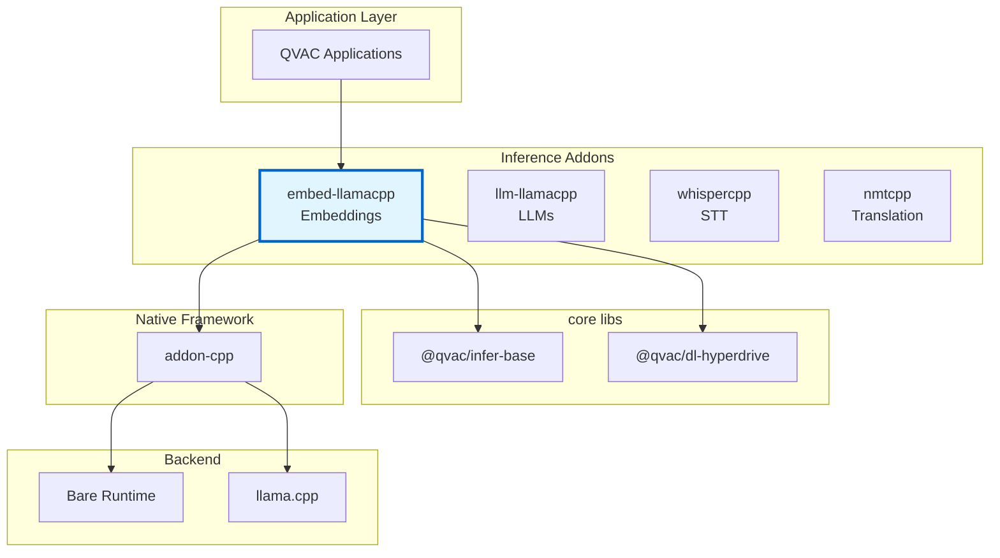
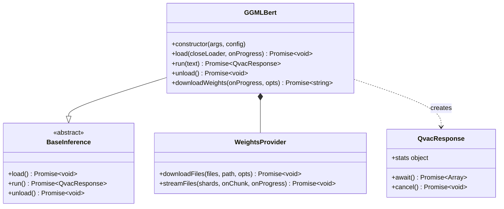
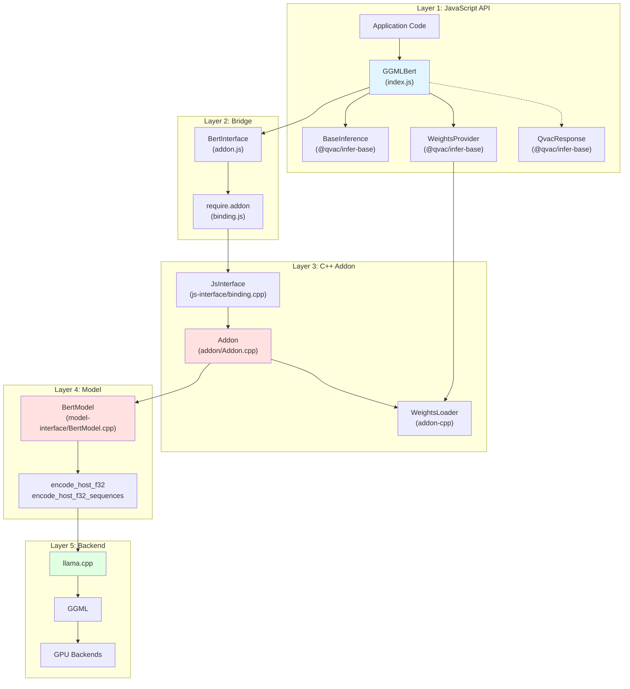
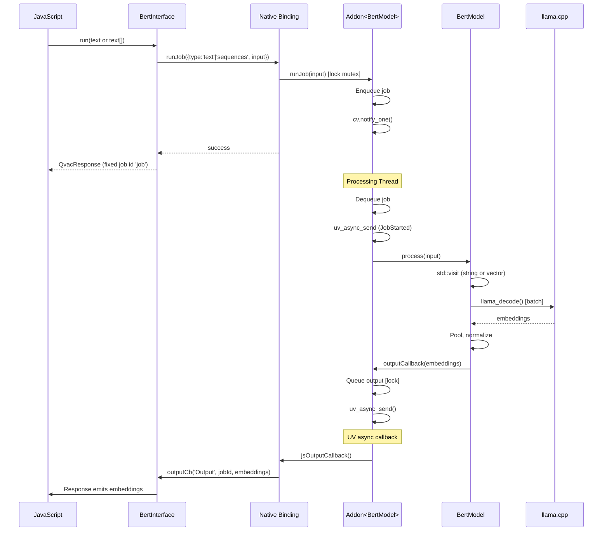

# Architecture Documentation

**Package:** `@qvac/embed-llamacpp` v0.11.0  
**Stack:** JavaScript, C++20, llama.cpp, Bare Runtime, CMake, vcpkg  
**License:** Apache-2.0  
**Addon-cpp:** ≥1.1.2 (single job per run, `runJob(input)`, `cancel()` waits until job stopped, no transition callback)

---

## Table of Contents

### Overview
- [Purpose](#purpose)
- [Key Features](#key-features)
- [Target Platforms](#target-platforms)

### Core Architecture
- [Package Context](#package-context)
- [Public API](#public-api)
- [Internal Architecture](#internal-architecture)
- [Core Components](#core-components)
- [Bare Runtime Integration](#bare-runtime-integration)

### Architecture Decisions
- [Decision 1: llama.cpp as Inference Backend](#decision-1-llamacpp-as-inference-backend)
- [Decision 2: Bare Runtime over Node.js](#decision-2-bare-runtime-over-nodejs)
- [Decision 3: Pluggable Data Loader Architecture](#decision-3-pluggable-data-loader-architecture)
- [Decision 4: Incremental Buffer-Based Weight Loading](#decision-4-incremental-buffer-based-weight-loading)
- [Decision 5: Batch Processing as Primary Use Case](#decision-5-batch-processing-as-primary-use-case)
- [Decision 6: Exclusive Run Queue](#decision-6-exclusive-run-queue)
- [Decision 7: TypeScript Definitions](#decision-7-typescript-definitions)

### Technical Debt
- [Limited Error Context](#1-limited-error-context)

---

# Overview

## Purpose

`@qvac/embed-llamacpp` is a cross-platform npm package providing text embedding generation for Bare runtime applications. It wraps llama.cpp in a JavaScript-friendly API, enabling local embedding model execution on desktop and mobile with CPU/GPU acceleration.

**Core value:**
- High-level JavaScript API for embedding generation
- Peer-to-peer model distribution via Hyperdrive
- Batch processing for high-throughput use cases
- Pluggable model weight loaders
- Vector embeddings for semantic search and similarity

## Key Features

- **Cross-platform**: macOS, Linux, Windows, iOS, Android
- **Multiple loaders**: Hyperdrive (P2P), filesystem, custom
- **Batch processing**: Process multiple texts in a single forward pass
- **GPU acceleration**: Metal, Vulkan, OpenCL
- **Quantized models**: GGUF format (Q2-Q8, 1-bit variants)
- **Sharded loading**: Automatic split GGUF handling
- **Encoder-only models**: Optimized for embedding generation

## Target Platforms

| Platform | Architecture | Min Version | Status | GPU Support |
|----------|-------------|-------------|--------|-------------|
| macOS | arm64, x64 | 14.0+ | ✅ Tier 1 | Metal |
| iOS | arm64 | 17.0+ | ✅ Tier 1 | Metal |
| Linux | arm64, x64 | Ubuntu-22+ | ✅ Tier 1 | Vulkan |
| Android | arm64 | 12+ | ✅ Tier 1 | Vulkan, OpenCL (Adreno 700+) |
| Windows | x64 | 10+ | ✅ Tier 1 | Vulkan |

Tier 1: Platform targets for which prebuilds are provided as defined by the .github/workflows/prebuilds-qvac-lib-infer-llamacpp-embed.yml workflow. Compilation and test failures for these targets will cause workflow runs to go red.

**Dependencies:**
- qvac-lib-inference-addon-cpp (≥1.1.2): C++ addon framework
- qvac-fabric-llm.cpp (≥7248.2.1): Inference engine
- Bare Runtime (≥1.24.0): JavaScript runtime

---

# Core Architecture

## Package Context

### Ecosystem Position

📊 LLM-Friendly: Package Relationships

**Dependency Table:**

| Package | Type | Version | Purpose |
|---------|------|---------|---------|
| @qvac/infer-base | Framework | ^0.2.2 | Base classes, WeightsProvider, QvacResponse |
| @qvac/dl-hyperdrive | Peer | ^0.1.0 | P2P model loading |
| qvac-lib-inference-addon-cpp | Native | ≥1.1.1 | C++ addon framework |
| llama.cpp | Native | ≥7248.1.0 | Inference engine |
| Bare Runtime | Runtime | ≥1.24.0 | JavaScript execution |

**Integration Points:**

| From | To | Mechanism | Data Format |
|------|-----|-----------|-------------|
| JavaScript | GGMLBert | Constructor | args, config objects |
| GGMLBert | BaseInference | Inheritance | Template method pattern |
| GGMLBert | BertInterface | Composition | Method calls |
| BertInterface | C++ Addon | require.addon() | Native binding |
| WeightsProvider | Data Loader | Interface | Stream protocol |

---

## Public API

### Main Class: GGMLBert

📊 LLM-Friendly: Class Responsibilities

**Component Roles:**

| Class | Responsibility | Lifecycle | Dependencies |
|-------|----------------|-----------|--------------|
| GGMLBert | Orchestrate model lifecycle, manage loading/inference | Created by user, persistent | WeightsProvider, BertInterface |
| BaseInference | Define standard inference API | Abstract base class | None |
| QvacResponse | Return embedding results | Created per run() call, short-lived | None |
| WeightsProvider | Abstract model weight loading | Created by GGMLBert | DataLoader |

**Key Relationships:**

| From | To | Type | Purpose |
|------|-----|------|---------|
| GGMLBert | BaseInference | Inheritance | Standard QVAC inference API |
| GGMLBert | WeightsProvider | Composition | Model weight acquisition |
| GGMLBert | QvacResponse | Creates | Embedding output per inference |

---

## Internal Architecture

### Architectural Pattern

The package follows a **layered architecture** with clear separation of concerns:

📊 LLM-Friendly: Layer Responsibilities

**Layer Breakdown:**

| Layer | Components | Responsibility | Language | Why This Layer |
|-------|------------|----------------|----------|----------------|
| 1. JavaScript API | GGMLBert, BaseInference | High-level API, error handling | JS | Ergonomic API for npm consumers |
| 2. Bridge | BertInterface, binding.js | JS↔C++ communication | JS wrapper | Lifecycle management, handle safety |
| 3. C++ Addon | JsInterface, Addon<T> | Job queue, threading, callbacks | C++ | Performance, native integration |
| 4. Model | BertModel, encode methods | Inference logic, batch processing | C++ | Direct llama.cpp integration |
| 5. Backend | llama.cpp, GGML | Tensor ops, GPU kernels | C++ | Optimized inference |

**Data Flow Through Layers:**

| Direction | Path | Data Format | Transform |
|-----------|------|-------------|-----------|
| Input → | JS → Bridge → Addon | runJob({ type, input }) | Single call, no job ID |
| Input → | Addon → Model | variant<string, vector<string>> | Parse input type |
| Input → | Model → llama.cpp | tokens | Tokenize, batch |
| Output ← | llama.cpp → Model | embedding vectors | Pool, normalize |
| Output ← | Model → Addon | BertEmbeddings | Convert to Float32Array |
| Output ← | Addon → Bridge | ArrayBuffer[] | Queue output |
| Output ← | Bridge → JS | Float32Array[] | Emit via callback |

---

## Core Components

### JavaScript Components

#### **GGMLBert (index.js)**

**Responsibility:** Main API class, orchestrates model lifecycle, manages data loaders

**Why JavaScript:**
- High-level API ergonomics for npm consumers
- Promise/async-await integration
- Configuration parsing
- Batch input detection and routing

#### **BertInterface (addon.js)**

**Responsibility:** JavaScript wrapper around native addon, manages handle lifecycle

**Why JavaScript:**
- Clean JavaScript API over raw C++ bindings
- Native handle lifecycle management
- Type conversion between JS and native

**Addon surface (addon-cpp ≥1.1.2):** Constructor `(binding, configurationParams, outputCb)` only (no transition callback). Single job per instance: `runJob({ type, input })` (no job ID returned), `cancel()` (waits until job stopped), `unload()` → `destroyInstance` to release resources.

### C++ Components

#### **BertModel (model-interface/BertModel.cpp)**

**Responsibility:** Core embedding implementation wrapping llama.cpp

**Why C++:**
- Direct integration with llama.cpp C API
- Performance-critical batch processing
- Memory-efficient token processing
- Native GPU backend access

**Key Methods:**
- `encode_host_f32(string)`: Single text embedding
- `encode_host_f32_sequences(vector<string>)`: Batch embedding generation
- `process(Input)`: Unified processing via std::visit

#### **Addon<BertModel> (addon/Addon.cpp)**

**Responsibility:** Template specialization of addon framework

**Why C++:**
- Provides job queue and priority scheduling
- Dedicated processing thread
- Thread-safe state machine
- Output dispatching via uv_async

**Specialization:** Handles variant input (string or vector<string>), merges batch inputs

#### **WeightsProvider (@qvac/infer-base)**

**Responsibility:** Abstracts model weight acquisition

**Why JavaScript:**
- Integrates with data loaders (Hyperdrive, filesystem)
- Progress tracking and reporting
- Handles sharded GGUF expansion
- Streaming chunk delivery

#### **BackendSelection (model-interface/BackendSelection.cpp)**

**Responsibility:** GPU backend selection at runtime (Android)

- Selects between CPU, Vulkan, and OpenCL backends at runtime
- Prefers OpenCL for Adreno 700+ GPUs, Vulkan otherwise
- Supports `main-gpu` config for integrated vs dedicated GPU selection
- Metal is compiled statically into macOS/iOS binaries (no runtime selection)
- Dynamic loading currently enabled on Android only

#### **LlamaLazyInitializeBackend (model-interface/LlamaLazyInitializeBackend.cpp)**

**Responsibility:** Deferred backend initialization and dynamic library loading

- Loads GPU backend libraries (`.so`/`.dylib`) at runtime from `backendsDir`
- Enables single binary distribution with optional GPU acceleration

---

## Bare Runtime Integration

### Communication Pattern

**Cancel:** `model.cancel()` or `response.cancel()` signals the current job to stop. The Promise resolves when the job has actually stopped (future-based in C++; model is not destroyed).

📊 LLM-Friendly: Thread Communication

**Thread Responsibilities:**

| Thread | Runs | Blocks On | Can Call |
|--------|------|-----------|----------|
| JavaScript | App code, callbacks | Nothing (event loop) | All JS, addon methods |
| Processing | Inference | model.process() | model.*, uv_async_send() |

**Synchronization Primitives:**

| Primitive | Purpose | Held Duration | Risk |
|-----------|---------|---------------|------|
| std::mutex | Protect job queue | <1ms | Low (brief) |
| std::condition_variable | Wake processing thread | N/A | None |
| uv_async_t | Wake JS thread | N/A | None |

**Thread Safety Rules:**

1. ✅ Call addon methods from any thread
2. ✅ Processing thread calls model methods
3. ❌ Don't call JS functions from C++ thread (use uv_async_send)
4. ❌ Don't call model methods from JS thread

---

# Architecture Decisions

## Decision 1: llama.cpp as Inference Backend

⚡ TL;DR

**Chose:** llama.cpp over MLC-LLM and other alternatives  
**Why:** Simpler integration, broader model support, mature ecosystem  
**Cost:** Large binary size, C++ build complexity, API instability

### Context

Need high-performance, cross-platform embedding generation for resource-constrained environments (laptops, mobile devices) with support for:
- Various embedding model architectures (BERT, GTE, E5, etc.)
- Quantization for reduced memory footprint
- GPU acceleration on diverse hardware
- Batch processing for high-throughput use cases

### Decision

Use llama.cpp (via vcpkg) as the core inference engine instead of MLC-LLM, ONNX Runtime, or custom implementation.

### Rationale

**Performance:**
- Industry-leading inference speed through highly optimized C++ and platform-specific SIMD
- Supports 1-8 bit quantization reducing memory by 2-8x with minimal accuracy loss
- GPU acceleration via Metal (Apple) and Vulkan (cross-platform)
- Efficient batch processing for multiple texts

**Model Support:**
- Supports all major embedding models (GTE, E5, BGE, etc.) and finetuned variants
- Active community adding new model support rapidly
- GGUF format is becoming de facto standard for quantized models

**Development Velocity:**
- Very active development with daily improvements
- Large community identifying and fixing issues quickly
- Comprehensive examples and documentation

### Trade-offs
- ✅ Broadest platform support (desktop + mobile, all major OSes)
- ✅ Most extensive model ecosystem (GGUF is de facto standard)
- ✅ Best balance of performance and memory efficiency across platforms
- ❌ Large binary size
- ❌ C++ build complexity
- ❌ API instability (frequent breaking changes)

---

## Decision 2: Bare Runtime over Node.js

See [qvac-lib-inference-addon-cpp Decision 4: Why Bare Runtime](https://github.com/tetherto/qvac-lib-inference-addon-cpp/blob/main/docs/architecture.md#decision-4-why-bare-runtime) for rationale.

**Summary:** Mobile support (iOS/Android), lightweight, modern addon API. Core business logic remains runtime-agnostic.

---

## Decision 3: Pluggable Data Loader Architecture

⚡ TL;DR

**Chose:** Abstract data loading via WeightsProvider interface  
**Why:** Support multiple distribution methods (P2P, HTTP, local files, S3)  
**Cost:** Additional abstraction layer, must implement loader interface

### Context

Need to load multi-GB model files from various sources:
- Local filesystem (for offline/development)
- P2P networks (for privacy/decentralization)
- HTTP/CDN (for enterprise deployments)
- Cloud storage (S3, Azure Blob, etc.)

Different use cases have different distribution requirements. No single distribution method fits all scenarios.

### Decision

Create a pluggable data loader abstraction (WeightsProvider interface) that decouples model loading from the inference engine, allowing applications to choose their distribution strategy.

### Rationale

**Flexibility:**
- Different users have different distribution needs (privacy vs speed vs simplicity)
- Enterprises may require HTTP/CDN, privacy users may prefer P2P
- Development/testing needs local filesystem access
- No single distribution method fits all use cases

**Separation of Concerns:**
- Inference engine doesn't need to know about distribution details
- Model loading is orthogonal to inference logic
- Easier to test inference separately from data loading

**Extensibility:**
- Applications can implement custom loaders (S3, IPFS, Torrent, etc.)
- Can optimize loaders for specific platforms (mobile vs desktop)
- Future-proof: new distribution methods don't require engine changes

### Trade-offs
- ✅ Can mock loaders for unit testing inference logic
- ❌ Additional abstraction complexity vs hardcoding a single method
- ❌ Applications must choose/implement their loader (no batteries-included default)

---

## Decision 4: Incremental Buffer-Based Weight Loading

⚡ TL;DR

**Chose:** Buffer-based weight loader using custom std::streambuf over JavaScript ArrayBuffers  
**Why:** Avoid storage duplication, zero-copy, supports incremental shard-by-shard loading  
**Cost:** Complex streambuf implementation, JavaScript reference lifecycle management

### Context

ML models can be gigabytes in size. llama.cpp expects either:
1. A file descriptor (simple but requires file on disk)
2. A buffer (via `std::streambuf` interface)

**Problem:** We need to load directly from Hyperdrive (P2P storage) without duplicating storage by saving to disk first.

Alternative approach would be: download from Hyperdrive → save to temp file → pass file descriptor to llama.cpp. But this doubles storage requirements (Hyperdrive cache + temp file).

### Decision

Implement custom `std::streambuf` over JavaScript-owned ArrayBuffers with incremental shard-by-shard loading, as provided by `qvac-lib-inference-addon-cpp` framework. This allows feeding buffer chunks from any source (Hyperdrive, HTTP, local files) directly to llama.cpp without intermediate file storage.

JavaScript sends model data as buffer chunks, C++ wraps them in a `std::streambuf`, enabling llama.cpp to load sharded models incrementally with zero-copy access to JavaScript memory.

### Rationale

**Avoid Storage Duplication:**
- Load directly from Hyperdrive streams without saving to disk first
- No temporary files consuming additional storage
- Critical for mobile devices with limited storage
- Hyperdrive data stays in its cache, not duplicated

**Zero-Copy:**
- C++ reads directly from JavaScript ArrayBuffer memory
- No memcpy of multi-GB model files
- Further reduces memory footprint

**Source Flexibility:**
- Works with any data source (Hyperdrive, HTTP, filesystem)
- Data loader provides buffer chunks, streambuf wrapper handles delivery to llama.cpp
- Same incremental loading path for all distribution methods
- Supports sharded GGUF files with incremental tensor loading

### Trade-offs
- ✅ Can report loading progress per chunk
- ❌ Complex streambuf implementation with seeking across blobs
- ❌ Must keep JS buffers alive during load, defer cleanup to correct thread
- ❌ Seeking overhead O(N) across N blobs (acceptable, rarely needed)

---

## Decision 5: Batch Processing as Primary Use Case

⚡ TL;DR

**Chose:** Native batch processing support with array input and optimized batching  
**Why:** High-throughput requirements for vector databases and semantic search  
**Cost:** More complex input handling, memory management for large batches

### Context

Embedding generation is often used in high-throughput scenarios:
- Vector database indexing (thousands of documents)
- Batch similarity computation
- Semantic search preprocessing
- RAG pipeline document processing

Processing texts one-by-one is too slow for these use cases. Need efficient batch processing.

### Decision

Support batch processing natively by accepting both single strings and arrays of strings, with automatic batching optimization in C++.

**Input Types:**
- `string`: Single text → single embedding
- `string[]`: Multiple texts → multiple embeddings (batched)

**Batching Strategy:**
- Accumulate sequences token-by-token until `batch_size` is reached
- Process accumulated sequences in single forward pass
- Larger `batch_size` = more sequences per batch (better throughput, more memory)

### Rationale

**Performance:**
- Single forward pass processes multiple texts efficiently
- GPU utilization improved with larger batches
- Reduces per-text overhead (model loading, context setup)
- Critical for high-throughput use cases

**API Simplicity:**
- Single API handles both single and batch cases
- Automatic detection of input type
- No need for separate batch API

**Memory Efficiency:**
- Configurable batch size balances throughput vs memory
- Unified KV cache when `n_parallel = 1` supports up to 64 sequences
- Token-based batching prevents context overflow

### Trade-offs
- ✅ High throughput for vector database indexing
- ✅ Simple API (same method for single/batch)
- ✅ GPU utilization optimized for batches
- ❌ More complex input handling (variant types)
- ❌ Memory usage scales with batch size
- ❌ Context overflow protection needed per sequence

---

## Decision 6: Exclusive Run Queue

⚡ TL;DR

**Chose:** Promise-based exclusive run queue using `_withExclusiveRun()` wrapper  
**Why:** Ensure atomic multi-step operations complete without interruption  
**Cost:** One inference request at a time per model instance

### Context

With addon-cpp ≥1.1.2, a single inference request is one `runJob({ type, input })` call (full input in one shot). The addon allows only one job at a time. Without coordination, a second `run()` could call `runJob()` while the first job is still processing, which the addon rejects.

### Decision

Implement JavaScript-level promise queue using `_withExclusiveRun()` helper so that only one `run()` (and thus one `runJob()`) is in progress at a time. This avoids races and ensures the addon’s single-job contract is respected.

**Note:** C++ level thread safety (mutex-protected job queue) and single-job semantics (runJob, cancel waits until stopped) are handled by the addon-cpp (≥1.1.1) framework.

### Rationale

**Atomicity:**
- Only one `runJob()` is issued at a time per model instance
- Prevents “a job is already set or being processed” from overlapping calls
- Each request gets exclusive access until the response is returned

**Message Integrity:**
- Model receives one coherent input per job
- No interleaving of concurrent requests

### Trade-offs
- ✅ Simple promise-based queue (no complex locking)
- ✅ Predictable sequential execution order
- ❌ One request at a time per model instance
- ❌ Head-of-line blocking (long request delays subsequent ones)

**Mitigation:** Create multiple model instances for parallel requests

---

## Decision 7: TypeScript Definitions

⚡ TL;DR

**Chose:** Hand-written TypeScript definitions (index.d.ts)  
**Why:** Type safety, IDE support, API documentation  
**Cost:** Manual maintenance, must keep in sync with implementation

### Context

Many developers use TypeScript. Need to provide type information for better developer experience, IDE autocomplete, and compile-time error checking.

### Decision

Provide hand-written TypeScript definitions in `index.d.ts` alongside JavaScript implementation.

### Rationale

**Developer Experience:**
- IDE autocomplete for methods and parameters
- Compile-time error checking
- Inline documentation in tooltips
- Type inference for response objects

**Documentation:**
- Types serve as living API documentation
- Clear contracts for all public methods
- Parameter descriptions and constraints

### Trade-offs
- ✅ Catch errors at compile time
- ✅ Refactor/rename symbols safely with IDE support
- ❌ Maintenance burden (must keep .d.ts in sync with .js)
- ❌ Some dynamic behaviors hard to type (partial coverage)

**Mitigation:** Test with `npm run test:dts` (runs `tsc --noEmit`)

---

# Technical Debt

### 1. Limited Error Context
**Status:** C++ exceptions lose stack traces crossing JS boundary  
**Issue:** Generic error messages make debugging difficult  
**Root Cause:** Bare's `js.h` doesn't support error stacks  
**Plan:** Implement structured error objects with error codes and context

---

**Related Document:**
- [data-flows-detailed.md](data-flows-detailed.md) - Detailed data flow diagrams and sequences

**Last Updated:** 2026-02-17
