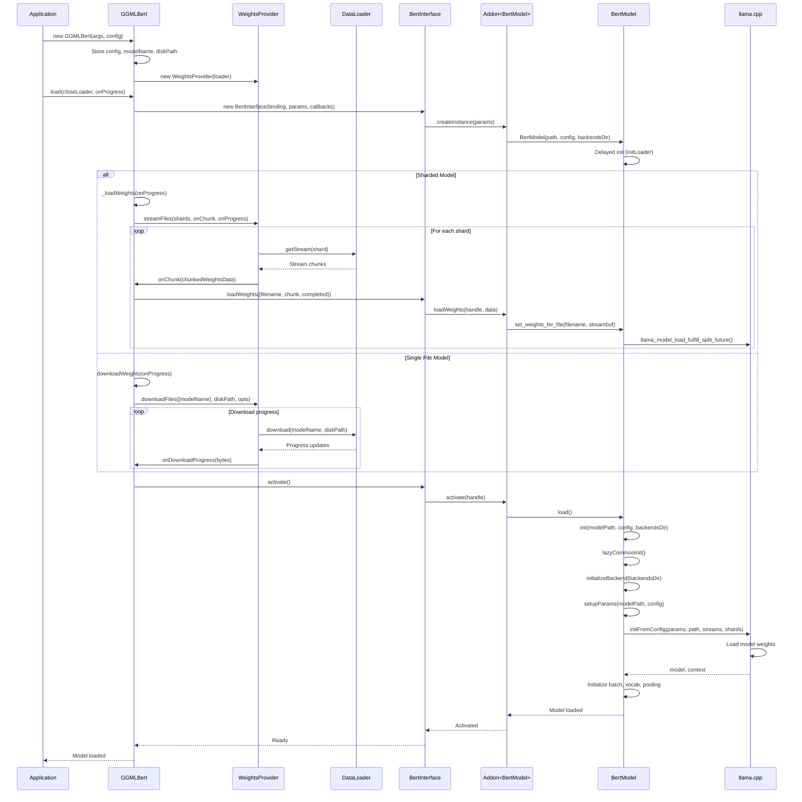
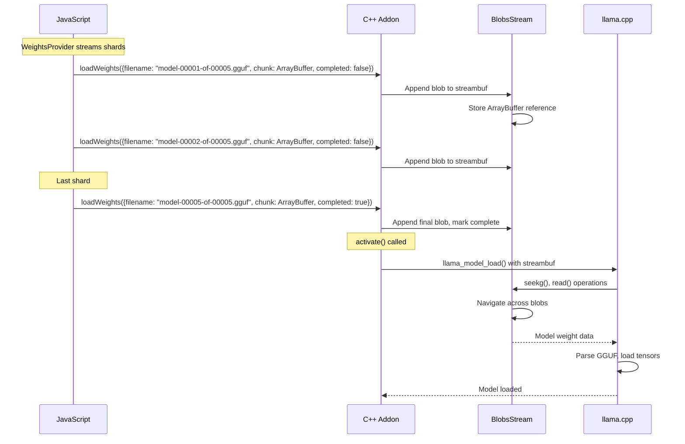
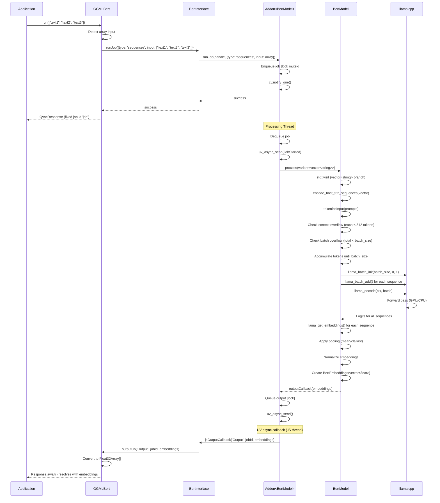
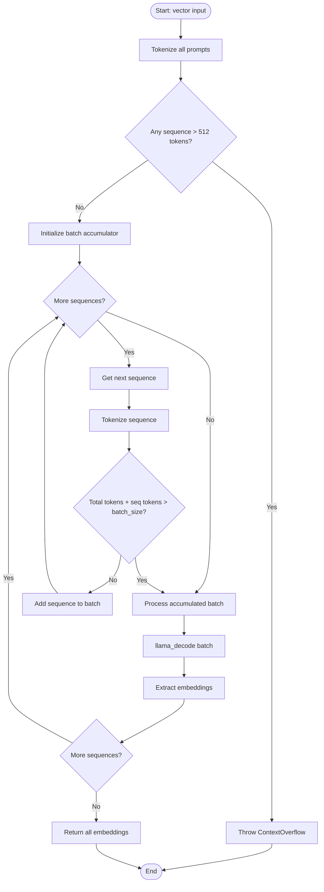
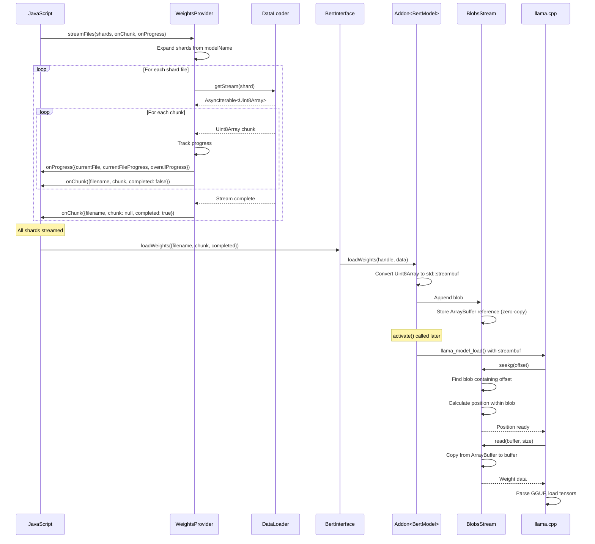
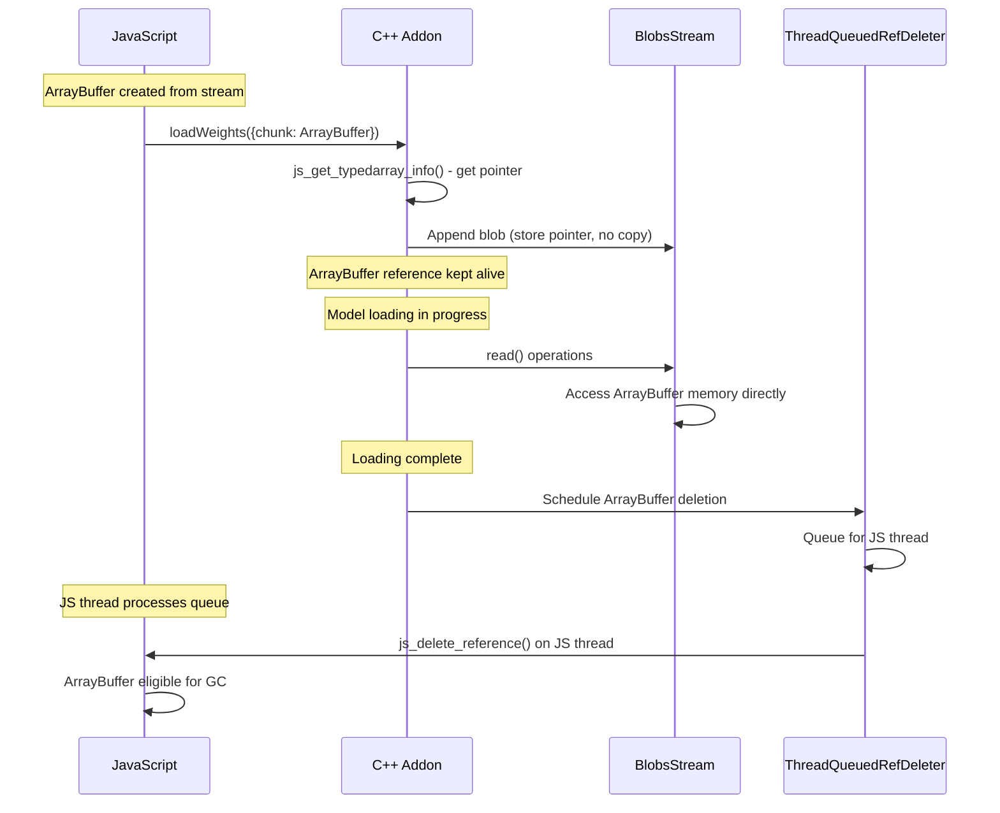
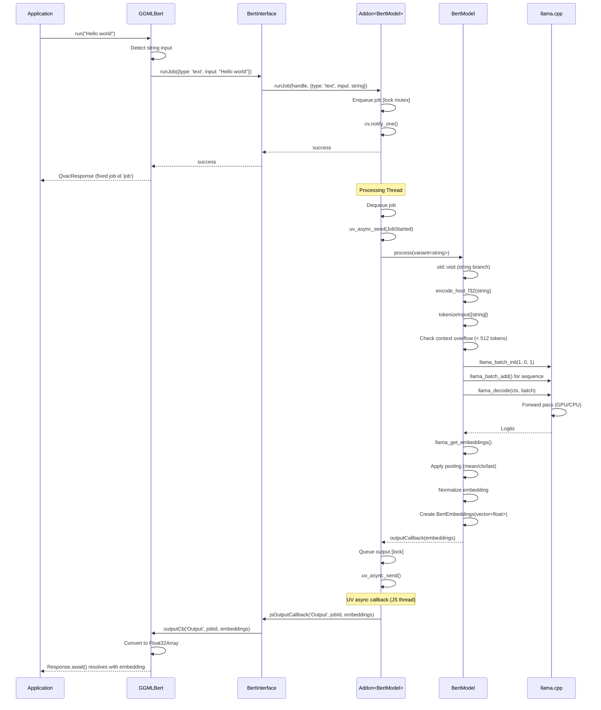
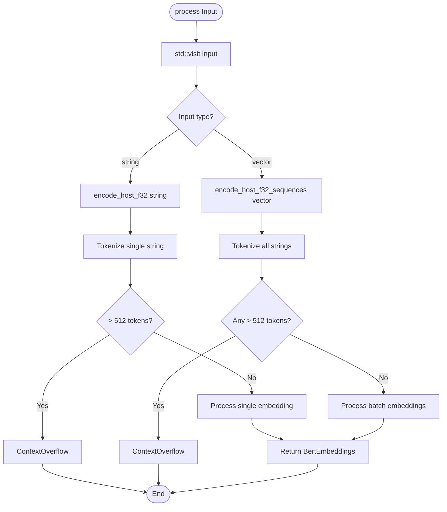

# Detailed Flow Diagrams

**⚠️ Warning:** These diagrams may become outdated as the codebase evolves. For debugging, regenerate diagrams from the actual code paths.

**Recommendation:** When investigating issues, trace through the code directly rather than relying solely on these diagrams.

---

## Table of Contents

- [Model Loading Flow](#model-loading-flow)
- [Batch Embedding Generation Flow](#batch-embedding-generation-flow)
- [Weight Loading Flow](#weight-loading-flow)
- [Single Text Embedding Flow](#single-text-embedding-flow)

---

## Model Loading Flow

### Complete Loading Sequence



### Sharded Model Loading Detail



---

## Batch Embedding Generation Flow

### Complete Batch Processing Sequence



### Batch Token Accumulation Detail



---

## Weight Loading Flow

### Streaming Weight Loading Sequence



### Memory Lifecycle



---

## Single Text Embedding Flow

### Single Text Processing Sequence



---

## Input Type Detection and Routing

### JavaScript Input Detection

```mermaid
flowchart TD
    Start([run input]) --> CheckType{Is Array?}
    CheckType -->|Yes| ArrayPath[type: 'sequences'<br/>input: string[]]
    CheckType -->|No| StringPath[type: 'text'<br/>input: string]
    ArrayPath --> RunJob[runJob to addon]
    StringPath --> RunJob
    RunJob --> Return[Return QvacResponse with fixed job id]
```

### C++ Input Routing



---

**Last Updated:** 2026-02-17
