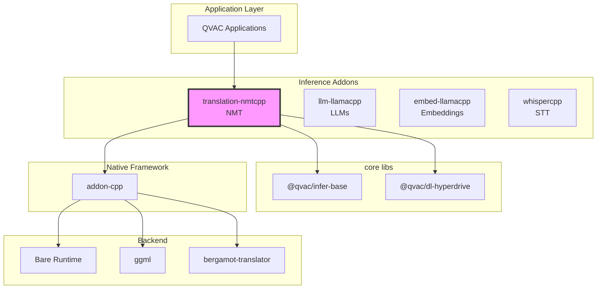
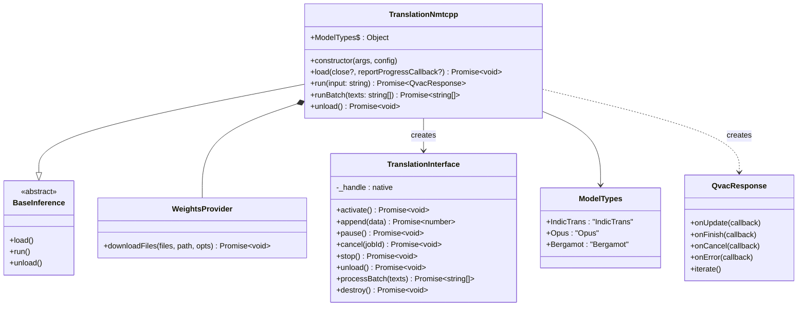
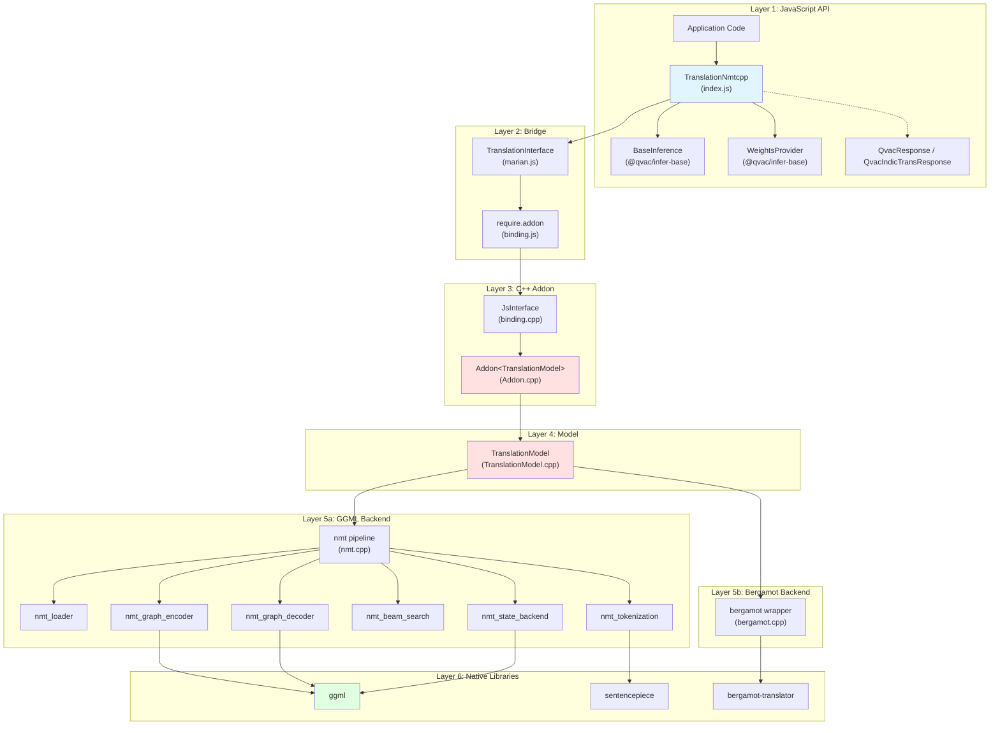
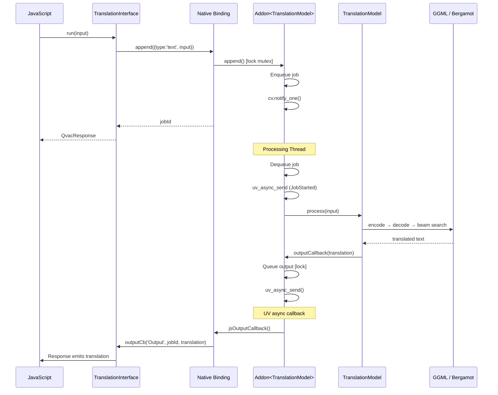

# Architecture Documentation

**Package:** `@qvac/translation-nmtcpp` v0.3.7  
**Stack:** JavaScript, C++20, GGML, Bergamot, Bare Runtime, CMake, vcpkg  
**License:** Apache-2.0

---

## Table of Contents

### Overview
- [Purpose](#purpose)
- [Key Features](#key-features)
- [Target Platforms](#target-platforms)

### Core Architecture
- [Package Context](#package-context)
- [Public API](#public-api)
- [Internal Architecture](#internal-architecture)
- [Core Components](#core-components)
- [Bare Runtime Integration](#bare-runtime-integration)

### Architecture Decisions
- [Decision 1: GGML as Inference Backend](#decision-1-ggml-as-inference-backend-for-opusmarian-and-indictrans2)
- [Decision 2: Bare Runtime over Node.js](#decision-2-bare-runtime-over-nodejs)
- [Decision 3: Multiple NMT Backends](#decision-3-multiple-nmt-backends-ggml--bergamot)
- [Decision 4: SentencePiece Tokenization](#decision-4-sentencepiece-tokenization)
- [Decision 5: Queue-Based Inference via Addon Framework](#decision-5-queue-based-inference-via-addon-framework)

### Technical Debt
- [Legacy "Marian" Naming](#1-legacy-marian-naming)
- [Whisper.cpp as Indirect GGML Provider](#2-whispercpp-as-indirect-ggml-provider)
- [Overlay Ports Instead of Registry](#3-overlay-ports-instead-of-registry)

---

# Overview

## Purpose

Offline neural machine translation for QVAC-powered applications (mobile and desktop). Translates text between language pairs using multiple NMT backends, each optimized for different language families and performance profiles.

**Core value:**
- High-level JavaScript API for NMT inference
- Peer-to-peer model distribution via Hyperdrive
- Multi-backend architecture (OPUS/Marian, IndicTrans2, Bergamot)
- Batch translation support
- Pluggable model weight loaders

## Key Features

- **Multi-backend architecture:** GGML-based custom NMT (OPUS/Marian and IndicTrans2) and Mozilla Bergamot
- **Cross-platform support:** macOS, iOS, Linux, Android, Windows
- **GPU acceleration:** via GGML backends (Metal on Apple, Vulkan on others)
- **Beam search decoding** with configurable beam size, length penalty, and repetition control
- **SentencePiece tokenization** for subword segmentation
- **Batch translation** (Bergamot backend) for high-throughput scenarios
- **P2P model distribution** via Hyperdrive
- **Queue-based inference** with pause/cancel/resume support

## Target Platforms

| Platform | Architecture | Min Version | Status | GPU Support |
|----------|-------------|-------------|--------|-------------|
| macOS | arm64, x64 | 14.0+ | ✅ Tier 1 | Metal |
| iOS | arm64 | 17.0+ | ✅ Tier 1 | Metal |
| Linux | arm64, x64 | Ubuntu-22+ | ✅ Tier 1 | Vulkan |
| Android | arm64 | 12+ | ✅ Tier 1 | Vulkan |
| Windows | x64 | 10+ | ✅ Tier 1 | Vulkan |

**Dependencies:**
- qvac-lib-inference-addon-cpp (≥0.12.2): C++ addon framework
- ggml (vcpkg): Tensor computation and GPU backends
- sentencepiece (vcpkg): Subword tokenization
- bergamot-translator (vcpkg, optional): Mozilla Bergamot translation engine
- Bare Runtime (≥1.19.0): JavaScript runtime

---

# Core Architecture

## Package Context

### Ecosystem Position

📊 LLM-Friendly: Package Relationships

**Dependency Table:**

| Package | Type | Version | Purpose |
|---------|------|---------|---------|
| @qvac/infer-base | Framework | ^0.2.0 | Base classes, WeightsProvider, QvacResponse |
| @qvac/dl-hyperdrive | Framework | ^0.1.0 | P2P model distribution |
| qvac-lib-inference-addon-cpp | Native | ≥0.12.2 | C++ addon framework (threading, job queue, JS interop) |
| ggml | Native | (vcpkg) | Tensor computation and GPU backends |
| sentencepiece | Native | (vcpkg) | Subword tokenization |
| protobuf | Native | (vcpkg) | SentencePiece model serialization |
| bergamot-translator | Native | (vcpkg, optional) | Mozilla Bergamot translation engine |
| Bare Runtime | Runtime | ≥1.19.0 | JavaScript execution |

**Integration Points:**

| From | To | Mechanism | Data Format |
|------|----|-----------|-------------|
| JavaScript | TranslationNmtcpp | Constructor | args, config objects |
| TranslationNmtcpp | BaseInference | Inheritance | Template method pattern |
| TranslationNmtcpp | TranslationInterface | Composition | Method calls |
| TranslationInterface | C++ Addon | require.addon() | Native binding |
| WeightsProvider | Data Loader | Interface | Stream protocol |

---

## Public API

### Main Class: TranslationNmtcpp

📊 LLM-Friendly: Class Responsibilities

**Component Roles:**

| Class | Responsibility | Lifecycle | Dependencies |
|-------|---------------|-----------|--------------|
| TranslationNmtcpp | Orchestrate model lifecycle, manage loading/inference | Created by user, persistent | WeightsProvider, TranslationInterface |
| BaseInference | Define standard inference API | Abstract base class | None |
| QvacResponse | Stream inference output | Created per run() call, short-lived | None |
| WeightsProvider | Abstract model weight loading | Created by TranslationNmtcpp | DataLoader |

**Key Relationships:**

| From | To | Type | Purpose |
|------|----|------|---------|
| TranslationNmtcpp | BaseInference | Inheritance | Standard QVAC inference API |
| TranslationNmtcpp | WeightsProvider | Composition | Model weight acquisition |
| TranslationNmtcpp | TranslationInterface | Composition | Native addon operations |
| TranslationNmtcpp | QvacResponse | Creates | Streaming output per inference |

---

## Internal Architecture

### Architectural Pattern

The package follows a **layered architecture** with clear separation of concerns:

📊 LLM-Friendly: Layer Responsibilities

**Layer Breakdown:**

| Layer | Components | Responsibility | Language | Why This Layer |
|-------|-----------|---------------|----------|----------------|
| 1. JavaScript API | TranslationNmtcpp, BaseInference | High-level API, error handling | JS | Ergonomic API for npm consumers |
| 2. Bridge | TranslationInterface, binding.js | JS↔C++ communication | JS wrapper | Lifecycle management, handle safety |
| 3. C++ Addon | JsInterface, Addon\<T\> | Job queue, threading, callbacks | C++ | Performance, native integration |
| 4. Model | TranslationModel | Backend detection and dispatch | C++ | Multi-backend routing |
| 5a. GGML Backend | nmt_* modules | Custom encoder-decoder with beam search | C++ | OPUS/Marian/IndicTrans2 inference |
| 5b. Bergamot Backend | bergamot wrapper | Bergamot translator integration | C++ | Batch-optimized translation |
| 6. Native Libraries | ggml, sentencepiece, bergamot | Tensor ops, tokenization, translation | C++ | Optimized inference |

**Data Flow Through Layers:**

| Direction | Path | Data Format | Transform |
|-----------|------|-------------|-----------|
| Input → | JS → Bridge → Addon | string | Pass input text |
| Input → | Addon → Model | std::string | Route to backend |
| Input → | Model → nmt_* | tokens | SentencePiece tokenize |
| Output ← | nmt_* → Model | token IDs | Beam search → detokenize |
| Output ← | Model → Addon | UTF-8 string | Queue output |
| Output ← | Addon → Bridge → JS | string | Emit via callback |

---

## Core Components

### JavaScript Components

#### **TranslationNmtcpp (index.js)**

**Responsibility:** Main API class, orchestrates model lifecycle, manages data loaders, routes to correct backend

**Why JavaScript:**
- High-level API ergonomics for npm consumers
- Promise/async-await integration
- IndicTrans pre/post-processing via third-party JS module
- Configuration parsing

#### **TranslationInterface (marian.js)**

**Responsibility:** JavaScript wrapper around native addon, manages handle lifecycle

**Why JavaScript:**
- Clean JavaScript API over raw C++ bindings
- Native handle lifecycle management
- Logger bridge (C++ → JS)
- Type conversion between JS and native

#### **QvacIndicTransResponse (index.js)**

**Responsibility:** IndicTrans-specific response with pre/post-processing via `IndicProcessor`

**Why JavaScript:**
- Script normalization/denormalization is text processing, not performance-critical
- Leverages existing third-party IndicProcessor JS module

### C++ Components

#### **TranslationModel (model-interface/TranslationModel.cpp)**

**Responsibility:** High-level model: backend detection (GGML vs Bergamot), config management, dispatch

**Why C++:**
- Direct integration with both GGML and Bergamot C/C++ APIs
- Backend auto-detection from model file format
- Unified process() interface over heterogeneous backends

#### **Addon\<TranslationModel\> (addon/Addon.cpp)**

**Responsibility:** Template specialization of addon framework

**Why C++:**
- Provides job queue and priority scheduling
- Dedicated processing thread
- Thread-safe state machine
- Output dispatching via uv_async
- Batch processing helper functions

#### **nmt_context / nmt_* (model-interface/nmt*.cpp)**

**Responsibility:** GGML-based NMT: encode, decode, full translation pipeline

**Why C++:**
- Performance-critical inference loop (encoder/decoder graphs)
- Direct GGML tensor operations
- Beam search with KV cache management
- SentencePiece integration for tokenization

**Key structures:** `nmt_context`, `nmt_model`, `nmt_state`, `nmt_vocab`, `nmt_config`, `nmt_kv_cache`

#### **bergamot_context (model-interface/bergamot.cpp)**

**Responsibility:** Bergamot wrapper: init, translate, batch translate, runtime stats

**Why C++:**
- Wraps Mozilla bergamot-translator C++ library
- Exposes single and batch translation
- Manages BlockingService and TranslationModel lifecycle

#### **WeightsProvider (@qvac/infer-base)**

**Responsibility:** Abstracts model weight acquisition

**Why JavaScript:**
- Integrates with data loaders (Hyperdrive, filesystem)
- Progress tracking and reporting
- Handles multi-file downloads (model + vocabularies)

---

## Bare Runtime Integration

### Communication Pattern

📊 LLM-Friendly: Thread Communication

**Thread Responsibilities:**

| Thread | Runs | Blocks On | Can Call |
|--------|------|-----------|---------|
| JavaScript | App code, callbacks | Nothing (event loop) | All JS, addon methods |
| Processing | Inference | model.process() | model.*, uv_async_send() |

**Synchronization Primitives:**

| Primitive | Purpose | Held Duration | Risk |
|-----------|---------|--------------|------|
| std::mutex | Protect job queue | <1ms | Low (brief) |
| std::condition_variable | Wake processing thread | N/A | None |
| uv_async_t | Wake JS thread | N/A | None |

**Thread Safety Rules:**

1. ✅ Call addon methods from any thread
2. ✅ Processing thread calls model methods
3. ❌ Don't call JS functions from C++ thread (use uv_async_send)
4. ❌ Don't call model methods from JS thread

---

# Architecture Decisions

## Decision 1: GGML as Inference Backend for OPUS/Marian and IndicTrans2

⚡ TL;DR

**Chose:** Custom encoder-decoder on GGML over full Marian framework  
**Why:** Cross-platform portability, quantization support, no heavy dependencies  
**Cost:** Custom encoder/decoder graphs require maintenance

### Context

Needed to run Marian-style NMT models on mobile devices (iOS, Android) and desktop without depending on the full Marian framework.

### Decision

Implemented a custom encoder-decoder inference engine on top of GGML tensors, with hand-built computation graphs for self-attention, cross-attention, FFN, and beam search.

### Rationale

**Portability:**
- GGML provides cross-platform tensor operations with minimal dependencies
- Supports multiple GPU backends (Metal, Vulkan) through a unified API
- No dependency on Python, CUDA, or heavy ML frameworks

**Efficiency:**
- Enables model quantization for reduced memory footprint on mobile
- Single dependency (ggml) for all tensor computation

### Trade-offs
- ✅ Runs on all target platforms including iOS and Android
- ✅ Quantization support reduces model size significantly
- ✅ Single dependency (ggml) for all tensor computation
- ❌ Custom encoder/decoder graphs require maintenance when model architectures evolve
- ❌ Performance tuning must be done manually per-platform

---

## Decision 2: Bare Runtime over Node.js

See [qvac-lib-inference-addon-cpp Decision 4: Why Bare Runtime](https://github.com/tetherto/qvac-lib-inference-addon-cpp/blob/main/docs/architecture.md#decision-4-why-bare-runtime) for rationale.

**Summary:** Mobile support (iOS/Android), lightweight, modern addon API. Core business logic remains runtime-agnostic.

---

## Decision 3: Multiple NMT Backends (GGML + Bergamot)

⚡ TL;DR

**Chose:** Three backends behind a unified API  
**Why:** Different language families need different model architectures and optimizations  
**Cost:** Three backends to build, test, and maintain

### Context

Different language families require different model architectures. European language pairs are well-served by OPUS/Marian models, Indic languages by IndicTrans2, and some use cases benefit from Mozilla's Bergamot for batch throughput.

### Decision

Support three model types behind a unified `TranslationNmtcpp` API, with backend auto-detection based on model file format.

### Rationale

**Language Coverage:**
- OPUS/Marian: broad European language coverage, established quality benchmarks
- IndicTrans2: purpose-built for Indic languages with specialized pre/post-processing
- Bergamot: mature, production-tested engine with batch translation support

**Unified API:**
- Consumers use the same `load()` / `run()` / `runBatch()` regardless of backend
- Backend selection is transparent via `ModelTypes` enum

### Trade-offs
- ✅ Best-in-class translation for each language family
- ✅ Unified API hides backend complexity from consumers
- ❌ Three backends to build, test, and maintain
- ❌ Different model formats and loading paths increase code complexity

---

## Decision 4: SentencePiece Tokenization

⚡ TL;DR

**Chose:** SentencePiece library for tokenization  
**Why:** Standard tokenizer used by OPUS and IndicTrans2 model authors  
**Cost:** Additional native dependency (protobuf required)

### Context

NMT models require subword tokenization. OPUS and IndicTrans2 models ship with SentencePiece vocabulary files.

### Decision

Use the SentencePiece library for tokenization and detokenization, loading vocabulary from model files or separate `.spm` files.

### Rationale

**Compatibility:**
- Standard tokenizer used by OPUS and IndicTrans2 model authors
- Handles both source and target vocabularies with a unified API
- Integrates cleanly with GGML model loading

### Trade-offs
- ✅ Direct compatibility with upstream model vocabularies
- ✅ Battle-tested library with broad language support
- ❌ Requires protobuf as transitive dependency
- ❌ Bergamot bundles its own SentencePiece, requiring careful linking

---

## Decision 5: Queue-Based Inference via Addon Framework

⚡ TL;DR

**Chose:** `qvac-lib-inference-addon-cpp`'s `Addon<T>` template  
**Why:** Proven pattern used by all QVAC inference addons, handles threading and lifecycle  
**Cost:** Template complexity, indirect control over processing thread

### Context

Translation requests arrive from the JavaScript thread but inference must run on a separate C++ thread to avoid blocking the event loop.

### Decision

Use `qvac-lib-inference-addon-cpp`'s `Addon<T>` template, which provides a job queue, worker thread, and callback mechanism for communicating results back to JavaScript.

### Rationale

**Proven Pattern:**
- Used by all QVAC inference addons (LLM, embeddings, STT)
- Handles thread synchronization, lifecycle management, and error propagation
- Supports pause/cancel/resume out of the box

**Consistency:**
- Same addon patterns across all inference packages
- Shared C++ framework reduces code duplication

### Trade-offs
- ✅ Battle-tested threading and lifecycle management
- ✅ Consistent patterns across QVAC inference addons
- ❌ One request at a time per model instance (exclusive run queue)
- ❌ Template metaprogramming adds build complexity

---

# Technical Debt

### 1. Legacy "Marian" Naming
**Status:** Present throughout codebase  
**Issue:** `marian.js`, `QvacErrorAddonMarian`, namespace `qvac_lib_inference_addon_mlc_marian` predate multi-backend architecture  
**Root Cause:** Renaming requires coordinated changes across JS, C++, and consumer packages  
**Plan:** Rename in a dedicated refactoring PR — `marian.js` → `translationInterface.js`, `QvacErrorAddonMarian` → `QvacErrorTranslation`, namespace → `qvac_lib_infer_nmtcpp`

### 2. Whisper.cpp as Indirect GGML Provider
**Status:** Active dependency — `whisper-cpp` is declared in `vcpkg.json` and built via a custom overlay port with multiple patches  
**Issue:** The package depends on `whisper-cpp` solely to obtain the `ggml` library it bundles as a submodule. No whisper.cpp APIs are used anywhere in the codebase. This adds unnecessary build complexity, overlay maintenance (build patches, cross-compile fixes), and a confusing dependency chain for contributors  
**Root Cause:** The package originally used MLC-LLM (as a git submodule) for its translation backend. In July 2025, MLC-LLM was removed and `whisper-cpp` was added to `vcpkg.json` as the vehicle to obtain a vcpkg-installable `ggml`.
**Plan:** Migrate to a standalone `ggml` vcpkg port, remove the `whisper-cpp` overlay port and its associated patches (`0001-fix-vcpkg-build.patch`, `0002-fix-apple-silicon-cross-compile.patch`), and update `vcpkg.json` to depend on `ggml` directly

### 3. Overlay Ports Instead of Registry
**Status:** 7 local overlay ports in `vcpkg-overlays/` — `whisper-cpp`, `bergamot-translator`, `marian-dev`, `ssplit`, `intgemm`, `ruy`, `simd-utils`  
**Issue:** Dependencies are maintained as local overlay ports with custom portfiles and patches instead of being published to `qvac-registry-vcpkg`. This duplicates port maintenance into the package itself, makes dependency updates error-prone, and diverges from the pattern already adopted by other inference packages (e.g. `qvac-lib-infer-whispercpp` migrated to the registry in `94bcdfc` — July 2025)  
**Root Cause:** The Bergamot backend was originally built from deeply nested git submodules (`bergamot-translator` → `marian-dev` → `intgemm`, `ruy`, `simd-utils`, `ssplit`). When the package migrated to vcpkg, these submodule trees were converted to local overlay ports to unblock the build, but were never promoted to the shared registry  
**Plan:** Publish all overlay ports to `qvac-registry-vcpkg`, remove the `vcpkg-overlays/` directory, and update `vcpkg-configuration.json` to resolve all dependencies from the registry. This can be done incrementally — `whisper-cpp` removal is covered by item #2, and the Bergamot chain (`bergamot-translator`, `marian-dev`, `ssplit`, `intgemm`, `ruy`, `simd-utils`) can be migrated as a group

---

**Related Document:**
- [data-flows-detailed.md](data-flows-detailed.md) - Detailed data flow diagrams and sequences

**Last Updated:** 2026-02-12
