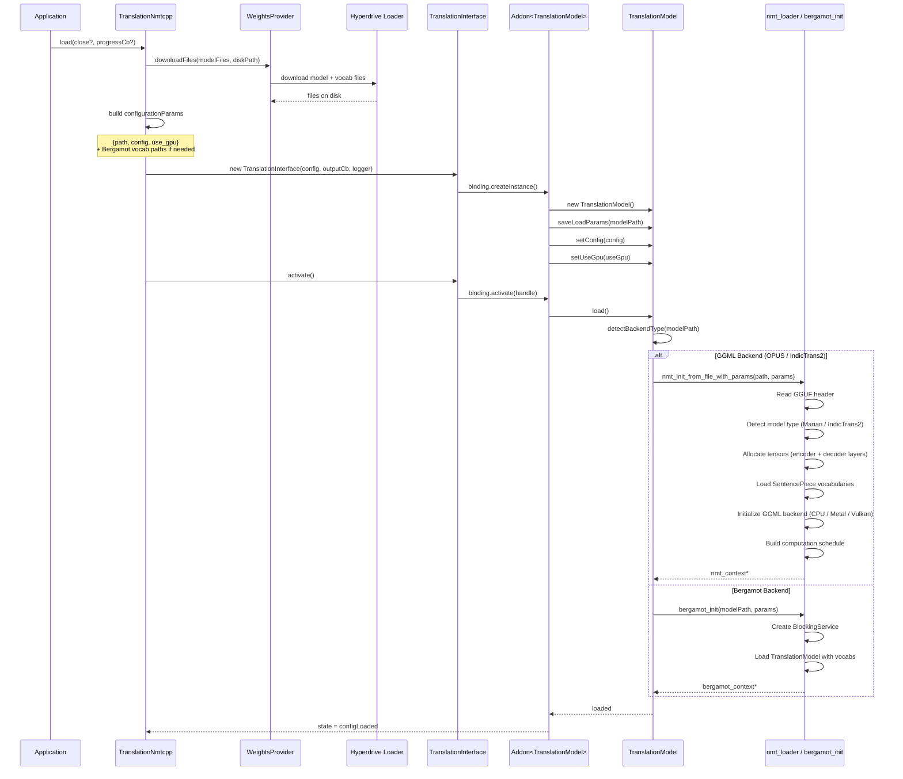
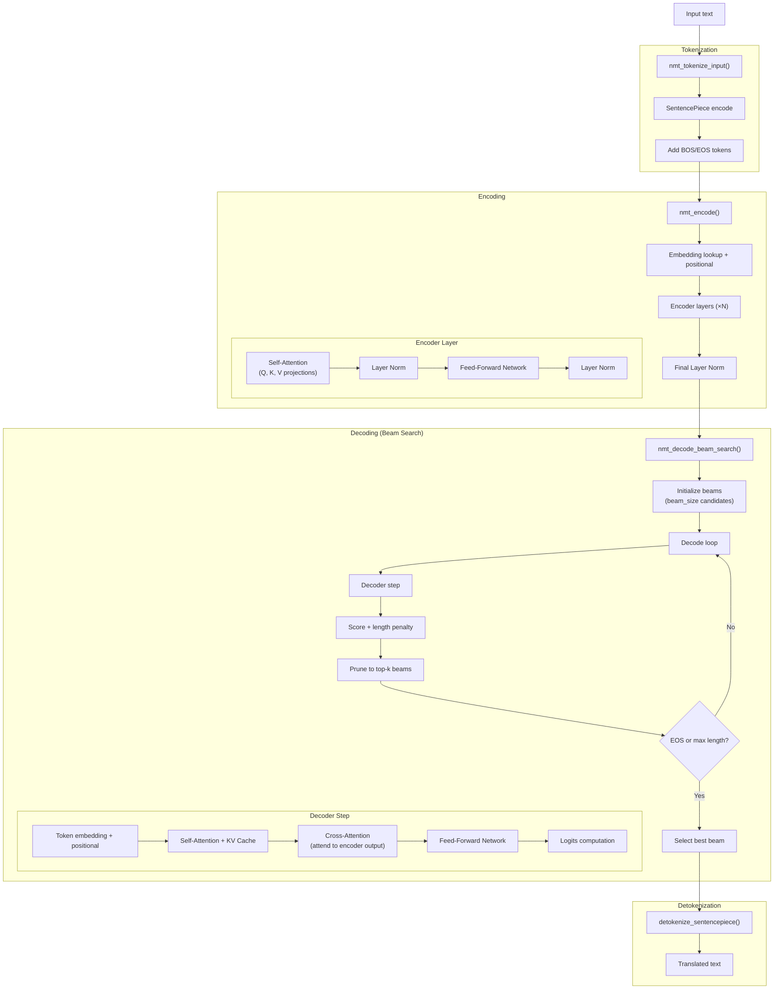
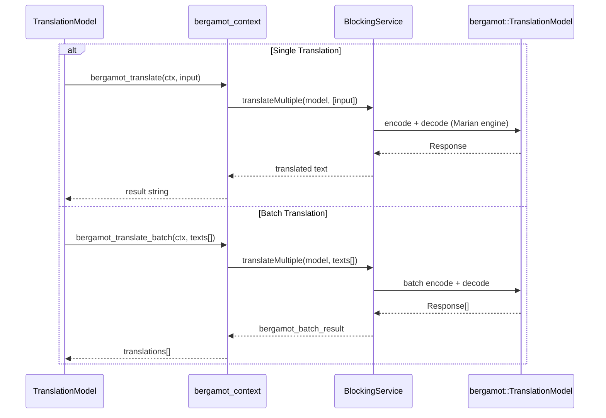
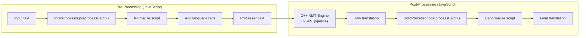
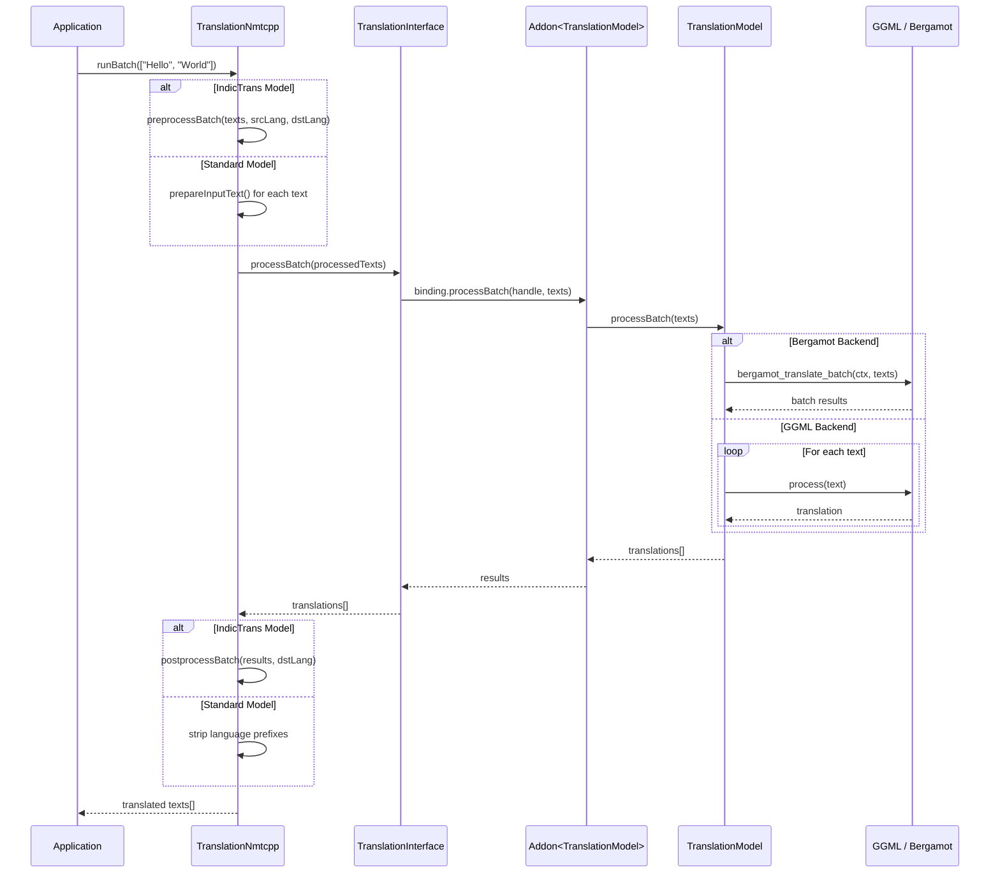
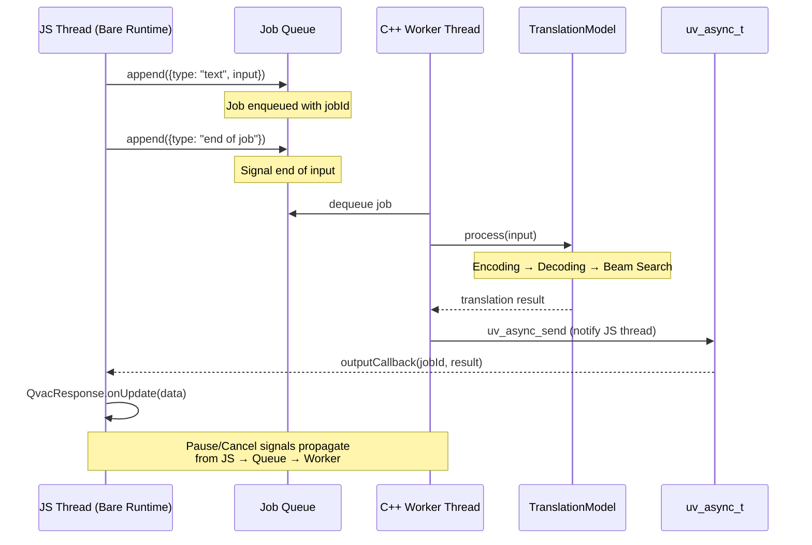

# Detailed Data Flows

This document contains detailed diagrams showing how data moves through the `@qvac/translation-nmtcpp` system.

**Audience:** Developers debugging complex behavior, contributors understanding system interactions.

> **⚠️ Note:** These detailed diagrams are intended for initial reference and can quickly become outdated as the codebase evolves. For exact debugging and deep understanding, regenerate diagrams from the actual code or trace through the implementation directly.

⚡ TL;DR: Data Flow Overview

**Communication Pattern:**
- Two-thread architecture: JavaScript thread + dedicated C++ processing thread
- Synchronization via mutex and condition variables
- Cross-thread flow: JS → queue job → wake C++ → process → output → uv_async_send → JS callback

**Translation Path (GGML):**
- JS calls `run(input)` → returns QvacResponse immediately (non-blocking)
- C++ thread dequeues job
- Calls `model.process()` → tokenize → encode → beam search decode → detokenize
- Queues output event → triggers JS callback asynchronously

**Translation Path (Bergamot):**
- Same JS flow, but C++ dispatches to `bergamot_translate()` or `bergamot_translate_batch()`
- Bergamot handles encoding/decoding internally via its BlockingService

**Batch Translation:**
- `runBatch()` bypasses the job queue and calls `processBatch()` directly
- Bergamot: true batch processing; GGML: sequential per-text processing

## Table of Contents

- [Model Loading Flow](#model-loading-flow)
- [GGML Translation Pipeline](#ggml-translation-pipeline-opus--marian--indictrans2)
- [Bergamot Translation Pipeline](#bergamot-translation-pipeline)
- [IndicTrans2 Pre/Post Processing](#indictrans2-prepost-processing-flow)
- [Batch Translation Flow](#batch-translation-flow-runbatch)
- [Job Queue and Threading Model](#job-queue-and-threading-model)

---

## Model Loading Flow

📊 LLM-Friendly: Model Loading Steps

| Step | Component | Action | Details |
|------|-----------|--------|---------|
| 1 | TranslationNmtcpp | downloadWeights | Downloads model + vocab via Hyperdrive |
| 2 | TranslationNmtcpp | build config | Assembles path, config, GPU flag, vocab paths |
| 3 | TranslationInterface | createInstance | Creates native Addon\<TranslationModel\> |
| 4 | Addon | configure | saveLoadParams, setConfig, setUseGpu |
| 5 | TranslationModel | load() | Detects backend type from model file |
| 6a | nmt_loader | init (GGML) | Read header, allocate tensors, load SPM, init backend |
| 6b | bergamot_init | init (Bergamot) | Create BlockingService, load model + vocabs |

---

## GGML Translation Pipeline (OPUS / Marian / IndicTrans2)

📊 LLM-Friendly: GGML Pipeline Breakdown

| Phase | Component | Operation |
|-------|-----------|-----------|
| Tokenization | nmt_tokenize_input | SentencePiece encode → add BOS/EOS |
| Encoding | nmt_encode | Embedding → N encoder layers (self-attention + FFN) → norm |
| Decoding | nmt_decode_beam_search | Initialize beams → decode loop (self-attn + cross-attn + FFN → logits → score → prune) → select best |
| Detokenization | detokenize_sentencepiece | SentencePiece decode → output text |

---

## Bergamot Translation Pipeline

📊 LLM-Friendly: Bergamot Flow

| Mode | Method | Flow |
|------|--------|------|
| Single | bergamot_translate | TranslationModel → BlockingService.translateMultiple([text]) → Response → string |
| Batch | bergamot_translate_batch | TranslationModel → BlockingService.translateMultiple(texts[]) → Response[] → string[] |

---

## IndicTrans2 Pre/Post Processing Flow

📊 LLM-Friendly: IndicTrans2 Processing

| Phase | Location | Operation |
|-------|----------|-----------|
| Pre-processing | JavaScript (IndicProcessor) | Normalize script → Add language tags |
| Inference | C++ (GGML) | Tokenize → Encode → Decode → Detokenize |
| Post-processing | JavaScript (IndicProcessor) | Denormalize script |

---

## Batch Translation Flow (runBatch)

📊 LLM-Friendly: Batch Translation Steps

| Step | Component | Action |
|------|-----------|--------|
| 1 | TranslationNmtcpp | Pre-process texts (IndicTrans: normalize; Standard: add lang prefix) |
| 2 | TranslationInterface | binding.processBatch(handle, texts) |
| 3a | TranslationModel (Bergamot) | bergamot_translate_batch — true batch |
| 3b | TranslationModel (GGML) | Sequential process() per text |
| 4 | TranslationNmtcpp | Post-process (IndicTrans: denormalize; Standard: strip prefixes) |

---

## Job Queue and Threading Model

📊 LLM-Friendly: Threading Model

| Thread | Action | Communication |
|--------|--------|---------------|
| JS Thread | append() jobs to queue | Job Queue (shared) |
| C++ Worker | dequeue and process | TranslationModel.process() |
| C++ Worker | signal result ready | uv_async_send |
| JS Thread | receive callback | outputCallback → QvacResponse.onUpdate |
| JS Thread | pause/cancel | Queue signal → Worker checks |

---

**Related Documents:**
- [architecture.md](architecture.md) - Complete architecture documentation

**Last Updated:** 2026-02-12
